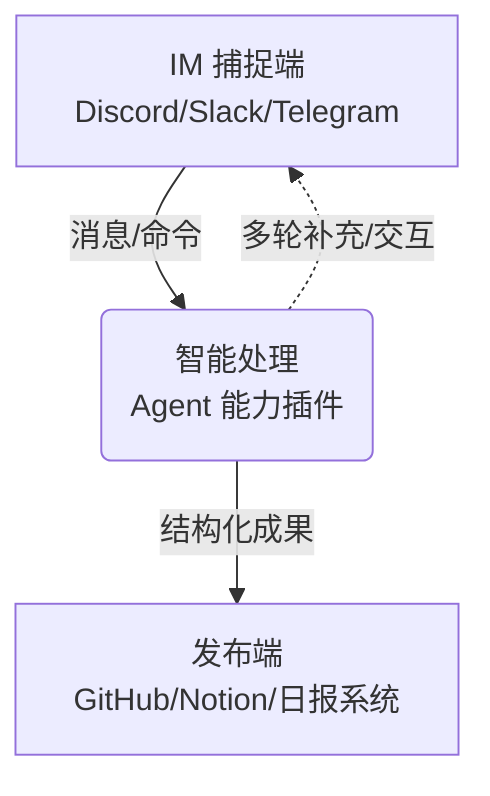

# Chatmill

> IM对话驱动的自动化协作与发布平台

---

## 平台简介

**Chatmill** 是一个面向团队的自动化协作平台，专注于从 IM 工具（如 Discord、Slack 等）捕捉对话内容，通过智能处理能力（agent 能力插件），将结构化成果自动发布到各类目标平台（发布端），如 GitHub、Notion、日报系统等。Chatmill 让需求捕捉、竞品监控、内容生成、任务拆解、提醒、反馈分析、内容发布等协作场景实现全流程自动化与智能化。

> 平台所有 API、Webhook、Agent 能力插件通信均支持 JWT（JSON Web Token）认证机制，保障接口安全与身份可信。

---

## 核心流程

- **捕捉端**：支持 Discord、Slack、Telegram 等主流 IM 工具，自动捕捉频道消息、命令、用户输入。
- **智能处理（agent 能力插件）**：通过策略注入/插件机制加载多种 agent 能力，实现需求总结、竞品监控、内容生成、任务拆解、提醒、反馈分析等。
- **发布端**：结构化成果自动发布到 GitHub、Notion、日报系统等目标平台，支持多平台扩展。

---

## Agent 能力一览

| 名称        | 角色职责              | 输入来源             | 输出格式               | 发布端           |
|-----------|-------------------|------------------|--------------------|---------------|
| Miss Spec | 捕捉需求、生成 PRD 草案    | Discord 讨论消息段、命令 | 标题、意图、功能点草案        | GitHub、Notion |
| Mr Pulse  | 竞品监控与自动简报         | RSS/Web、人工命令     | 结构化简报              | Notion、日报系统   |
| Echo      | 文案生成、多版本内容撰写      | 关键词、摘要、产品描述      | 推文、公众号、LinkedIn文案  | Twitter、公众号等  |
| Chisel    | 任务拆解、checklist 生成 | 高层级需求、PRD 草案     | 子任务清单、开发 checklist | GitHub、Notion |
| Nudge     | 延迟提醒、定期跟进提示       | 用户发言中的"以后搞一下"    | 待办清单、提醒            | Discord、日报提醒  |
| Reflecta  | 用户反馈收集与主题分析       | 用户留言、群聊反馈        | 主题报告、频率分析          | Notion、日报、看板  |
| Miss Post | 自动跨平台内容发布         | 结构化文案、媒体素材       | 已格式化内容             | Twitter、公众号等  |

> 所有 agent 能力均通过插件/策略机制动态加载，便于扩展和定制。

---

## 目录结构与文档主题

本仓库收录了 Chatmill 平台相关的全部文档，按主题分类如下：

- [deployment/](deployment/)：部署指南、平台适配与集成说明
- [uml/](uml/)：架构设计、领域建模、用例、交互等 UML 设计文档
- [instruction/](instruction/)：用户操作手册、FAQ、交互说明
- [developer/](developer/)：开发者向的架构、协议、领域、贡献、错误码等文档
- [README.md](README.md)：项目总览与文档导航入口

每个目录下均为 Markdown 文档，便于查阅和维护。

---

## 快速上手

1. 阅读 [deployment/DEPLOYMENT.md](deployment/DEPLOYMENT.md) 获取部署与环境配置方法
2. 按需配置 IM 捕捉端、agent 能力插件、发布端集成
3. 参考 [instruction/USER_GUIDE.md](instruction/USER_GUIDE.md) 体验典型协作流程

---

## 扩展与定制

- 支持自定义 agent 能力插件，按需扩展业务流
- 支持多平台 IM 捕捉端与多类型发布端
- 所有协议与中间结果统一采用 CML（Chatmill Language），兼容 YAML/JSON
- 支持标准 JWT 认证机制，便于与第三方平台安全集成
- 详见 [developer/CML_PROTOCOL.md](developer/CML_PROTOCOL.md)

---

## 贡献与开发

- 欢迎提交 PR、issue 或参与文档完善
- 贡献指南见 [developer/CONTRIBUTING.md](developer/CONTRIBUTING.md)
- 架构与领域建模详见 [developer/ARCHITECTURE.md](developer/ARCHITECTURE.md)

---

## License

✅ GNU Affero General Public License v3.0 (AGPL-3.0) 