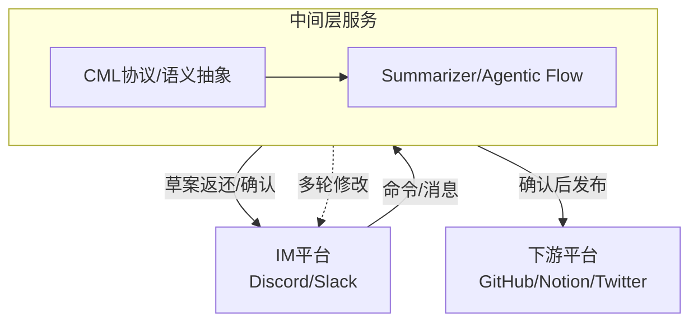

# Miss Spec

---

## Table of Contents

- [项目简介](#项目简介)
- [架构图](#架构图)
- [典型使用场景](#典型使用场景)
- [技术栈](#技术栈)
- [推荐目录结构](#推荐目录结构)
- [架构设计与未来演进](#架构设计与未来演进)
- [中间层领域语言（CML）](#中间层领域语言cml)
- [典型人机协作流程](#典型人机协作流程)
- [快速开始与部署指南](#快速开始与部署指南)
- [License](#license)

---

## 项目简介

Miss Spec 是一个自动化需求捕捉与协同工具，帮助团队成员在 Discord/Slack 等 IM 工具中，通过简单的交互操作，将频道中的讨论内容快速转化为结构化的需求草案，并同步至 GitHub 项目管理板，极大提升产品需求捕捉与任务协同的效率。

---

## 架构图



---

## 典型使用场景

### 场景一：产品经理捕捉需求
1. 产品经理在 Discord 频道与团队讨论新功能。
2. 讨论结束后，产品经理输入 `/missspec from:1001 to:1010`，唤起 Miss Spec agent。
3. Miss Spec 自动抓取消息段，调用大模型总结为结构化需求草案，并在 Discord 返回草案卡片。
4. 产品经理可直接确认或提出修改建议。
5. 确认后，需求草案自动同步到 GitHub 项目板，成为可追踪任务。

### 场景二：运营同学监控竞品
1. 运营在 Discord 频道输入 `/mrpulse monitor`，唤起 Mr Pulse agent。
2. Mr Pulse 自动抓取 RSS/Web 信息，生成竞品简报。
3. 简报以卡片形式返回 Discord，运营可确认或补充说明。
4. 确认后，简报同步到 Notion 日报库。

---

## 技术栈

- FastAPI（后端服务框架，API 层实现）
- Python（主力开发语言）
- Discord Bot SDK（上游集成）
- DeepSeek API（大模型总结）
- GitHub API（项目管理板集成）

---

#### 推荐目录结构

项目采用严格分层、无全局依赖的DDD结构，顶层只分上游（upstream）、中间层（midstream）、下游（downstream），每个大目录下自包含自己的领域模型与服务，便于未来微服务化拆分。

```plaintext
/src
  /upstream
    /discord
      /domain         # Domain models, aggregates, repository interfaces for Discord
      /application    # Application services, command parsing, business flows for Discord
      /infrastructure # Discord Bot SDK integration, API adapters
      /interfaces     # Event/command handlers, DTOs, API entrypoints
    # /slack
    # ...
  /midstream
    /cml
      /domain         # CML protocol, schema, validation
      /application    # CML generation, transformation, validation services
      /infrastructure # CML persistence, serialization
      /interfaces     # CML API, adapters
    /summarizer
      /domain         # Summarization/draft domain models
      /application    # LLM invocation, Agentic Flow logic
      /infrastructure # LLM API integration
      /interfaces     # Summarizer API
    # /feedback
    # ...
  /downstream
    /github
      /domain         # GitHub domain models, aggregates
      /application    # Issue/Project sync services
      /infrastructure # GitHub API integration
      /interfaces     # Webhook, API entrypoints
    # /notion
    # ...
```

- Each major module is fully self-contained with clear DDD layering.
- No shared or core global modules; all reuse is via protocol (e.g. CML) or explicit dependency.
- This structure is naturally decoupled and ready for future microservice extraction.

---

## 快速开始与部署指南

### 1. 克隆本仓库

```bash
git clone <repo-url>
cd missspec
```

### 2. 安装依赖

```bash
pip install -r requirements.txt
```

### 3. 配置环境变量

在项目根目录下创建 `.env` 文件，填写如下内容：

```env
# Discord Bot
DISCORD_TOKEN=your_discord_token
DISCORD_CLIENT_ID=your_discord_client_id

# GitHub
GITHUB_TOKEN=your_github_token
GITHUB_PROJECT_ID=your_github_project_id

# 大模型（DeepSeek等）
LLM_MODEL=deepseek
LLM_API_KEY=your_deepseek_api_key

# 其他可选配置
# ...
```

### 4. 启动服务

```bash
uvicorn main:app --reload
```

### 5. 邀请 Bot 加入 Discord 频道，开始使用 Slash Command

---

## License

MIT

---

## 架构设计与未来演进

### 当前架构设计

Miss Spec 目前采用单体（Mono-Repo）架构，聚焦于 Discord（上游）、DeepSeek（中间层）、GitHub（下游）的自动化需求流转。整体架构分为三层：

- **上游（Upstream）**：负责接收和解析 Discord 消息、命令等输入。
- **中间层（Midstream）**：负责调用大模型（如 DeepSeek）进行内容总结、结构化处理，未来可扩展为多步 Agentic Flow。
- **下游（Downstream）**：负责将结构化需求同步到 GitHub 项目管理板。

各层通过接口/适配器模式解耦，便于未来扩展和替换。

#### 推荐目录结构

项目采用严格分层、无全局依赖的DDD结构，顶层只分上游（upstream）、中间层（midstream）、下游（downstream），每个大目录下自包含自己的领域模型与服务，便于未来微服务化拆分。

```plaintext
/src
  /upstream
    /discord
      /domain         # Domain models, aggregates, repository interfaces for Discord
      /application    # Application services, command parsing, business flows for Discord
      /infrastructure # Discord Bot SDK integration, API adapters
      /interfaces     # Event/command handlers, DTOs, API entrypoints
    # /slack
    # ...
  /midstream
    /cml
      /domain         # CML protocol, schema, validation
      /application    # CML generation, transformation, validation services
      /infrastructure # CML persistence, serialization
      /interfaces     # CML API, adapters
    /summarizer
      /domain         # Summarization/draft domain models
      /application    # LLM invocation, Agentic Flow logic
      /infrastructure # LLM API integration
      /interfaces     # Summarizer API
    # /feedback
    # ...
  /downstream
    /github
      /domain         # GitHub domain models, aggregates
      /application    # Issue/Project sync services
      /infrastructure # GitHub API integration
      /interfaces     # Webhook, API entrypoints
    # /notion
    # ...
```

- Each major module is fully self-contained with clear DDD layering.
- No shared or core global modules; all reuse is via protocol (e.g. CML) or explicit dependency.
- This structure is naturally decoupled and ready for future microservice extraction.

### 扩展性与未来演进

为支持更多业务场景（如 MrPulse 竞品监控、Echo 内容分发等），Miss Spec 架构预留了以下扩展点：

- **多上游/多下游支持**：未来可通过插件/适配器机制，支持 Slack、Twitter 等更多平台。
- **中间层可插拔**：支持不同大模型、提示词模板，未来可扩展为 Agentic Flow 或多步处理。
- **微服务化与事件驱动**：
  - 各层可独立拆分为微服务，通过 Event Bus（事件总线）进行解耦与通信。
  - 中间层服务可采用策略模式，灵活选择处理流程。
  - 下游内容发布系统通过订阅 Event Bus，实现多渠道内容分发。
- **新服务集成**：如 MrPulse，可作为独立服务无缝集成到整体架构中。

### 未来演进路线

1. 单体架构下通过接口/适配器模式实现解耦，便于未来拆分。
2. 随业务发展，将上游、下游、中间层拆分为独立微服务。
3. 引入 Event Bus，实现事件驱动与服务间解耦。
4. 支持多上游、多下游、多中间层服务的灵活组合与扩展。

### Chat Mill未来扩展蓝图

下述表格梳理了系统未来可支持的上游平台、中间处理助手、下游内容发布渠道，为后续功能扩展和服务拆分提供参考。

#### 上游平台

| 平台       | 角色        | 接入方式                   | 优先级   |
|----------|-----------|------------------------|-------|
| Discord  | 主工作场所     | Bot + Slash + Reaction | ✅ 高   |
| Slack    | 企业拓展      | Bot + Event API        | ✅ 中高  |
| Telegram | 信息发布 / 报警 | Bot API                | ⚪ 轻辅助 |
| Web 表单   | 非实时输入来源   | 接 webhook              | ⚪ 可选  |

#### 中间处理层

| 助手            | 职责       | 输入               | 输出格式        | 下游落地点              |
|---------------|----------|------------------|-------------|--------------------|
| **Miss Spec** | PRD 草案生成 | 讨论消息段            | 标题、用户意图、功能点 | Notion、GitHub Jira |
| **Mr Pulse**  | 竞品监控     | RSS / Web / 人工命令 | 结构化简报       | Notion、日报          |
| **Echo**      | 文案生成     | 关键词 / 摘要         | 推文、多版本 Copy | Twitter / Notion   |
| **Chisel**    | 任务拆解     | 高阶需求             | Checklist   | GitHub             |
| **Nudge**     | 延迟任务提醒   | 对话痕迹             | 提醒/待办清单     | Discord 通知         |
| **Reflecta**  | 用户反馈总结   | 用户对话             | 主题分析 / 报告   | Notion、日报          |

#### 下游内容发布

| 平台                | 用途          | 接入方式         | 接收的数据格式             |
|-------------------|-------------|--------------|---------------------|
| GitHub Project v2 | 卡片型任务管理     | GraphQL API  | DraftIssue / Issue  |
| Notion            | 文档、汇总、内容    | REST API     | Page / Database row |
| Twitter / 社媒      | 发布通道        | 第三方 API      | 文案 + 媒体             |
| 邮件系统              | 团队播报        | SMTP webhook | 文字摘要                |
| Internal Chat（回贴） | 二次确认 / 成果展示 | Bot 发消息      | Markdown 卡片或链接      |

### 中间层领域语言（CML）

#### 🧠 为什么要定义自己的中间语？

| 问题           | 没有中间语会怎样                              | 有了中间语能怎样                    |
|--------------|---------------------------------------|-----------------------------|
| 多平台兼容        | 每个平台格式不一样（Discord ID、Slack timestamp） | 用统一的 message abstraction    |
| 内容抽象         | 平台 API 结构不同（Notion 是块，GitHub 是 issue） | 中间语统一表达：Section、Title、Tags  |
| 指令触发         | 每个平台命令机制不同                            | 中间语中统一为 `intent: summarize` |
| AI Prompt 分离 | 输入格式与输出格式混乱                           | 用中间语生成 prompt + 控制指令        |
| 回写输出         | GitHub 要字段，Notion 要页面                 | 中间语可以映射为结构化 payload         |

#### ✅ Chatmill 中间语设计方案

命名建议：`ChatSpecLang` / `CMLang` / `CML`

---

#### 📦 CML（Chatmill Language）语言层级设计

##### 🧾 1. 指令层：事件意图（Intent Layer）

```yaml
intent: summarize
agent: missSpec
source:
  platform: discord
  channel_id: 123456
  message_ids: [1001, 1002, 1003]
```

##### 🧠 2. 语义层：提取意图后的结构内容（Semantic Layer）

```yaml
summary:
  title: 支持扫码取件
  user_goal: 用户希望通过扫码方式简化取件流程
  feature_points:
    - 扫描二维码匹配订单
    - 校验后获取包裹码
    - 提示可视化界面
  priority: P0
```

##### 📤 3. 输出层：格式映射（Target Mapping）

```yaml
targets:
  - type: github
    format: issue
    repo: chatmill/project-specs
    fields:
      title: "{{summary.title}}"
      body: |
        用户目标：
        {{summary.user_goal}}

        功能点：
        
        - {{p}}
        

        优先级：{{summary.priority}}
  - type: notion
    format: page
    database_id: abc123
```

---

#### ✅ 设计要素与技术实现建议

| 设计要素     | 建议                                                   |
|----------|------------------------------------------------------|
| 🎯 指令动作  | `intent: summarize / feedback / pulse / echo`        |
| 🧱 抽象对象  | `summary / feature / feedback / campaign / task`     |
| 🧠 数据结构  | 标准字段：`title / description / tags / priority / owner` |
| 📦 映射模板  | 每个平台配置自己的 `target formatter`（模板系统）                   |
| 🔌 序列化方式 | 建议用 YAML or JSON（易做映射 + trace）                       |

- 使用 Python `pydantic` 或 TypeScript 类型定义中间语言数据结构
- 存为结构化 JSON / YAML
- 每个平台编写一组适配器：`CMLOutput → GitHub / Notion / Telegram / Discord`

---

#### ✨ 未来能力展望

| 能力           | 说明                       |
|--------------|--------------------------|
| 多平台统一任务写入    | 同一个指令，多个平台同步生成不同格式       |
| Prompt 模板结构化 | 从 CML 生成对 AI 的高质量 prompt |
| 回溯历史         | 每条事件都是结构化对象，方便版本管理       |
| 微服务 / 插件接口   | 任意一个服务都能读/写 CML 文件       |

---

#### 🎯 Chatmill 架构流程（文本版）

```
        [User Command from Discord]
                    ↓
             🎯 IntentExtractor
                    ↓
        📜 Internal CML (Chatmill Language)
                    ↓
     ┌───────────────┬───────────────┬────────────────┐
     │ GitHubAdapter │ NotionAdapter │ TwitterAdapter │
     └───────────────┴───────────────┴────────────────┘
```

后续如需详细的时序图、事件流示意或接口定义，可进一步补充。

### 典型人机协作流程

用户在 IM 平台（如 Discord）与 agent（如 Miss Spec）协作生成需求草案的完整闭环如下：

1. 用户在 IM 平台通过命令或交互唤起 agent。
2. agent 抓取消息段，生成结构化草案（CML）。
3. agent 将草案以消息形式返还到原平台，等待用户操作。
4. 用户可选择：
   - **确认**：草案被正式发布到下游平台（如 GitHub、Notion 等）。
   - **提出修改建议**：agent 根据建议重新总结，生成新草案，返回平台，进入新一轮确认。
5. 流程循环，直到用户确认。

#### 文本时序图示例

```
User        Agent          IM平台      下游平台
 |             |             |           |
 |--命令/交互-->|              |           |
 |             |---抓取消息--->|           |
 |             |---总结草案--->|           |
 |             |<---返还草案---|           |
 |<---草案消息---|             |           |
 |--确认/修改--->|             |           |
 |             |---如需修改--->|           |
 |             |----新草案---->|           |
 |             |<--返还新草案---|           |
 |<---新草案----|              |           |
 |----确认----->|              |            |
 |             |--发布到下游--->|           |
 |             |              |--落地内容-->｜
```

- agent 负责多轮总结与草案生成，直到用户满意为止。
- 只有用户确认后，内容才会正式同步到下游平台。

后续如需详细的时序图、事件流示意或接口定义，可进一步补充。 