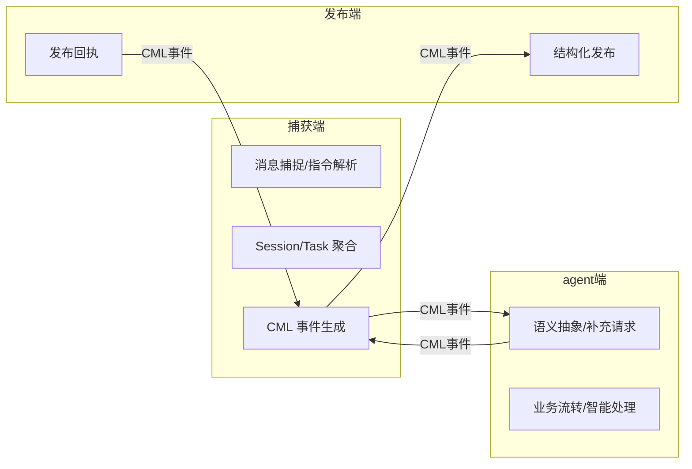

# Miss Spec 捕获端领域模型与 DDD 设计说明

## 1. 领域边界与上下文地图

- 捕获端（Capture）：负责 IM 平台（如 Discord）消息捕捉、指令解析、上下文管理、CML 事件生成。
- agent端（Agent）：负责语义抽象、智能补充、业务流转、补充请求等。
- 发布端（Publish）：负责结构化需求的发布、同步、回执（如 GitHub、Jira、Notion）。
- 各端通过 CML 协议（JSON/YAML）事件流解耦，所有跨端通信均为结构化事件。
- 捕获端领域层不依赖 agent端/发布端的具体实现，仅依赖协议。



## 2. 领域对象与聚合根

### Session（聚合根）
- 代表一次完整的需求捕捉与多轮交互流程，唯一 session_id，聚合所有相关消息、补充、确认、发布等事件。
- 必须字段：session_id, organization_id, project_id, participants, history, type, platform, agent, payload

| 字段名          | 类型       | 必填  | 说明                    |
|--------------|----------|-----|-----------------------|
| session_id   | string   | 是   | 会话唯一标识                |
| organization_id| string   | 是   | 捕获端平台服务器ID（如 Discord） |
| project_id   | string   | 是   | 捕获端平台频道ID             |
| participants | string[] | 是   | 当前与会人ID列表             |
| history      | string[] | 是   | 事件历史（所有CML事件ID）       |
| type         | string   | 是   | 当前会话状态/事件类型           |
| platform     | string   | 是   | 目标发布端（如 github、jira）  |
| agent        | string   | 是   | 归属 agent 能力插件（如 missspec、nudge、echo），用于多 agent 策略分发 |
| payload      | object   | 是   | 结构化负载（类型为StructuredPayload，具体结构由agent能力插件定义。下方示例为Miss Spec agent的Task实现） |

**示例：**
```json
{
  "session_id": "sess-001",
  "organization_id": "guild-100",
  "project_id": "chan-200",
  "participants": ["alice", "bob"],
  "history": ["msg-001", "msg-002"],
  "type": "initiate",
  "platform": "github",
  "agent": "missspec",
  "payload": { ... }
}
```

> organization_id/project_id 字段为平台无关抽象，映射关系如下：
> - Discord: organization_id = server_id, project_id = channel_id
> - Slack: organization_id = workspace_id, project_id = channel_id
> - 其他平台以适配器文档为准

> agent 字段用于标识本 session 归属的 agent 能力插件（如 missspec、nudge、echo），支持多 agent 扩展和策略分发。

### StructuredPayload（结构化负载接口/基类）
- 捕获端领域层只依赖该抽象接口，所有 agent 能力插件的结构化负载都应继承并实现。
- 通用字段（强制）：
  - external_id: str | None  # 外部平台唯一ID（如 issue id、card id 等）
  - message_ids: List[str/int]  # 溯源消息ID
- 其他字段（如 title、description 等）由具体 agent 能力插件自定义，不在抽象接口强制要求。

| 字段名        | 类型           | 必填  | 说明                       |
|------------|--------------|-----|--------------------------|
| external_id| string/null  | 否   | 外部平台唯一ID（如 issue id）   |
| message_ids| int[]/str[]  | 是   | 溯源消息ID                  |

#### Miss Spec agent 的 Task 实现（StructuredPayload 子类，仅为示例）
| 字段名         | 类型        | 必填  | 说明                   |
|-------------|-----------|-----|----------------------|
| missspec_id | string    | 是   | Miss Spec 本地唯一ID     |
| title       | string    | 是   | 任务标题                 |
| description | string    | 是   | 任务描述                 |
| storypoints | int/float | 否   | 预估工作量                |
| assignees   | string[]  | 否   | 责任人ID列表              |
| priority    | string    | 否   | 优先级（high/medium/low） |
| parent_task | string    | 否   | 父任务ID（顶层为null）       |
| sub_tasks   | object[]  | 否   | 子任务数组，结构同本表          |
| ...         | ...       | ...  | 继承StructuredPayload通用字段   |

### Message（消息）
- 捕获端平台单条消息。

| 字段名       | 类型     | 必填  | 说明           |
|-----------|--------|-----|--------------|
| id        | string | 是   | 消息唯一ID       |
| author    | string | 是   | 作者ID         |
| content   | string | 是   | 消息内容         |
| timestamp | string | 是   | 时间戳（ISO8601） |

## 3. 领域服务

| 服务名                      | 职责说明                                                                 |
|--------------------------|------------------------------------------------------------------------|
| CmlEventRelayService      | 捕获端统一接收、校验、分发所有 CML 事件（如 supplement_request、publish_result、agent 端自定义事件等），无需处理业务语义，只需保证 CML 句法和上下文一致性，将事件回显到 IM 平台。所有事件分发建议校验 JWT Token。|
| SessionService           | 聚合所有与 Session 相关的业务逻辑，包括与会人/责任人管理、状态流转、多轮交互、历史追踪等。所有敏感操作建议校验 JWT Token。|
| MessageFetcherService    | 根据消息ID抓取消息，聚合为 Message 实体。|
| CommandService           | 处理所有捕获端指令，协调消息抓取、session 管理、CML 组装与流转。|

> 说明：CmlEventRelayService 是捕获端的"事件透传/分发"总线，所有 webhook 事件（无论来自 agent 端还是发布端）都通过它统一校验、分发、回显，无需关心事件语义，只需保证 CML 句法和上下文一致性，便于未来扩展和平台解耦。

- 领域服务只暴露必要接口，所有外部输入通过 application/infrastructure 适配。
- 领域服务与聚合根（Session）紧密协作，保证业务规则和不变式。

## 4. 领域事件

| 事件类型                | 说明         | 主要字段（必填）                                                               |
|---------------------|------------|------------------------------------------------------------------------|
| initiate            | 发起需求捕捉     | session_id, organization_id, project_id, participants, payload, platform        |
| supplement_request  | 请求补充信息     | session_id, operator_id, question, required_fields, payload, participants |
| supplement_response | 提交补充内容     | session_id, operator_id, supplement_messages, payload, participants       |
| publish_result      | 发布端回传发布结果  | session_id, platform, payload, result, participants                       |
| add_participant     | 增加与会人      | session_id, operator_id, participants, target_participants             |
| remove_participant  | 移除与会人      | session_id, operator_id, participants, target_participants             |
| add_assignee        | 增加责任人      | session_id, operator_id, assignees, target_assignees                   |
| remove_assignee     | 移除责任人      | session_id, operator_id, assignees, target_assignees                   |
| modify            | 手动修改任务树/字段 | session_id, operator_id, mode, full_task/path/value                    |

- 事件均以 CML 结构化协议流转，支持溯源、追踪、状态机流转。
- 事件流转必须符合 INTERACTION_GUIDE.md 状态图。
- 结构化负载字段 payload 类型为 StructuredPayload，具体结构由 agent 能力插件定义，示例为 Miss Spec agent 的 Task。

## 5. 领域仓储（Repository）

- 领域仓储接口负责 Session、StructuredPayload、Message 等聚合根的持久化。所有仓储接口建议校验 JWT Token，防止未授权访问。
- 仅暴露 save/load/find_by_id 等接口，具体实现由 infrastructure 层适配。
- 示例接口：
  - SessionRepository.save(session: Session)
  - SessionRepository.get_by_id(session_id: str) -> Session
  - StructuredPayloadRepository.save(payload: StructuredPayload)
  - StructuredPayloadRepository.get_by_id(payload_id: str) -> StructuredPayload
  - MessageRepository.save(message: Message)
  - MessageRepository.get_by_id(message_id: str) -> Message

## 6. 领域不变式与业务规则

| 规则/约束                              | 说明                               |
|------------------------------------|----------------------------------|
| 只有与会人可进行 supplement/publish/modify | 非与会人操作无效，需校验权限                   |
| initiate 可由频道内任意成员发起               | 但需校验消息区间、@user有效性、GUILD_IDS等基础约束 |
| participants/assignees 变更需持久化并提示   | 变更后需在捕获端平台消息中同步当前与会人/责任人列表       |
| platform 必须在支持列表内                  | 如 github、jira、notion，未来可扩展       |
| 消息抓取总数最大 N 条（可配置，默认25）         | initiate/supplement 时，用户输入的所有消息ID（区间或离散）总数不得超过 N，超出需拒绝并提示。支持区间、逗号分隔、单条等多种输入方式，最终合并去重后校验总数。N 由配置项 MAX_MESSAGE_FETCH_COUNT 控制 |
| session、message、user等ID必须唯一且规范     | 防止溯源、权限、数据一致性问题                  |
| 事件流转必须符合状态机                        | 见 INTERACTION_GUIDE.md 状态图       |
| 补充消息ID允许重复输入                        | 用户可重复输入已补充过的消息ID，系统自动去重，仅补充未出现过的消息ID |
| publish 只允许一次         | 用户对同一 session 只能发布一次，重复操作直接提示"该需求已发布，无需重复操作。查看发布结果：<链接>" |

- 领域层强约束，所有校验点见 DEV_GUIDE.md 校验节点说明。

## 7. 典型用例与业务流程

### 用例1：需求捕捉与多轮补充
1. 用户在捕获端输入 `/missspec initiate 1..13,15,17,20..22 @Bob`，系统校验参数、抓取消息，合并所有区间和离散ID，去重后校验总数不超过 N，生成 Session。
2. agent端如需补充，发起 supplement_request，捕获端推送补充请求。
3. 与会人用 `/missspec supplement <session_id> 8,9,11,12,13..15` 补充，系统合并所有区间和离散ID，去重后校验总数，校验权限，生成 supplement_response。
   - 用户可重复输入已补充过的消息ID，系统自动去重，仅补充未出现过的消息ID，并在回显中提示哪些消息已被忽略（如全部重复则提示"所选消息已全部补充，无需重复操作"）。
4. 多轮补充后，与会人用 `/missspec publish <session_id> --to github` 发布，系统生成 publish 事件。
   - 若用户多次发布，系统检测 session 状态，若已发布，直接 return："该需求已发布，无需重复操作。查看发布结果：<链接>"。
5. 发布端收到 publish，发布需求，回传 publish_result。
6. 捕获端回显发布结果。
7. 如需手动修正任务树结构或内容，用户可用 `/missspec modify <session_id> {完整task的json}` 或 `/missspec modify <session_id> task.title 新的标题`，系统生成 modify 事件。

- 示例：Miss Spec agent 可实现 TaskRepository(StructuredPayloadRepository)，仅为实现示例。
