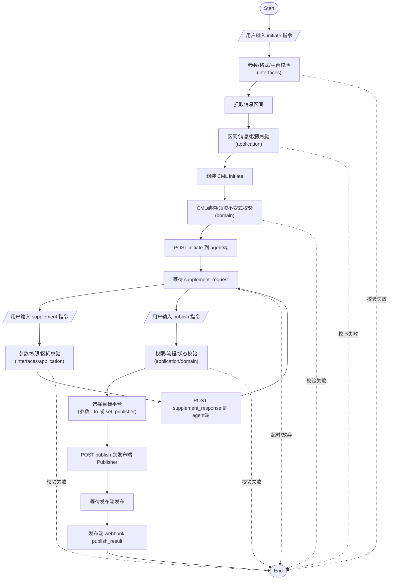

## 需求流转活动图

下图展示一次完整需求流转（initiate→补充→确认→发布）的主要活动与分支。

```mermaid
flowchart TD
  Start([Start])
  GetCmd[/用户输入 initiate 指令/]
  校验1["参数/格式/平台校验\n(interfaces)"]
  FetchMsg[抓取消息区间]
  校验2["区间/消息/权限校验\n(application)"]
  BuildCML[组装 CML initiate]
  校验3["CML结构/领域不变式校验\n(domain)"]
  PostSummarizer[POST initiate 到 agent端]
  WaitSupp[等待 supplement_request]
  Supplement[/用户输入 supplement 指令/]
  校验4["参数/权限/区间校验\n(interfaces/application)"]
  PostSupp[POST supplement_response 到 agent端]
  Confirm[/用户输入 publish 指令/]
  校验5["权限/流程/状态校验\n(application/domain)"]
  选择平台2["选择目标平台\n(参数 --to <platform> 或 set_publisher)"]
  PostConfirm[POST publish 到发布端 Publisher]
  WaitPublish[等待发布端发布]
  PublishResult[发布端 webhook publish_result]
  End([End])

  Start --> GetCmd
  GetCmd --> 校验1
  校验1 --> FetchMsg
  FetchMsg --> 校验2
  校验2 --> BuildCML
  BuildCML --> 校验3
  校验3 --> PostSummarizer
  PostSummarizer --> WaitSupp
  WaitSupp --> Supplement
  Supplement --> 校验4
  校验4 --> PostSupp
  PostSupp --> WaitSupp
  WaitSupp --> Confirm
  Confirm --> 校验5
  校验5 --> 选择平台2
  选择平台2 --> PostConfirm
  PostConfirm --> WaitPublish
  WaitPublish --> PublishResult
  PublishResult --> End

  %% 分支/循环说明
  校验1 -. 校验失败 .-> End
  校验2 -. 校验失败 .-> End
  校验3 -. 校验失败 .-> End
  校验4 -. 校验失败 .-> End
  校验5 -. 校验失败 .-> End
  WaitSupp -. 超时/放弃 .-> End
``` 