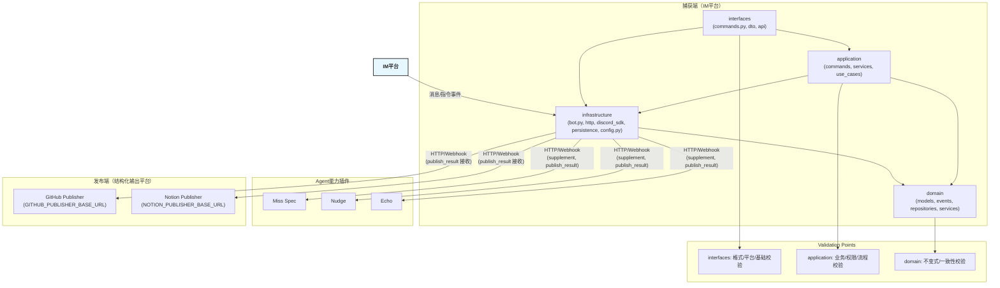

## 组件图

本模块采用 DDD 分层架构，所有外部通信均通过 infrastructure 层适配，支持未来多平台扩展。

> 说明：
> 
> - 本图展示了 Chatmill 的三大核心区块：捕获端（IM平台）、Agent（中间层能力插件）、发布端（结构化输出平台），以及它们之间的接口与依赖关系。
> - 捕获端负责从 IM 平台（如 Discord、Slack 等）接收消息和指令，通过接口适配层流入系统。
> - Agent 区块代表所有可插拔的中间层智能处理能力（如 Miss Spec、Nudge 等），通过标准 API 与捕获端通信。
> - 发布端区块代表所有结构化成果的落地平台（如 GitHub、Notion），支持多平台并行扩展。
> - 校验节点分别对应输入格式、业务流程、数据一致性等不同层级的校验职责，确保数据流转安全可靠。
> - 所有外部通信均通过 HTTP/Webhook 适配，便于未来扩展更多 IM 平台、Agent 能力和发布端。
> - 组件间依赖箭头标注了各区块之间、与校验节点、与外部服务的调用关系。
