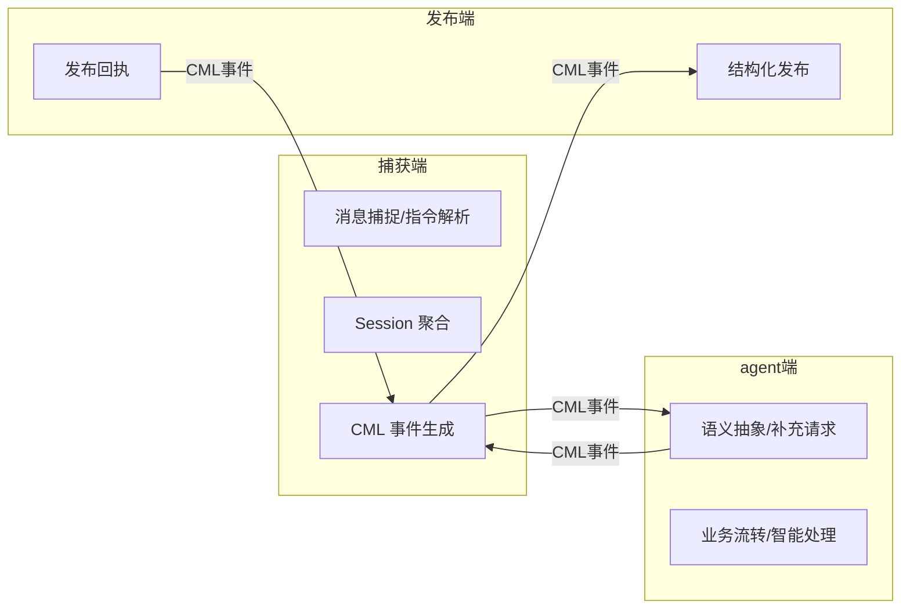

## 领域边界与上下文地图

- 捕获端（Capture）：负责 IM 平台（如 Discord）消息捕捉、指令解析、上下文管理、CML 事件生成。
- agent端（Agent）：负责语义抽象、智能补充、业务流转、补充请求等。
- 发布端（Publish）：负责结构化需求的发布、同步、回执（如 GitHub、Jira、Notion）。
- 各端通过 CML 协议（JSON/YAML）事件流解耦，所有跨端通信均为结构化事件。
- 捕获端领域层不依赖 agent端/发布端的具体实现，仅依赖协议。

> organization_id/project_id 字段为平台无关抽象，映射关系如下：
> - Discord: organization_id = server_id, project_id = channel_id
> - Slack: organization_id = workspace_id, project_id = channel_id
> - 其他平台以适配器文档为准

