## 领域核心类图

下图展示了捕获端领域层的主要实体、聚合与关系，突出结构化负载的抽象与解耦。

图表说明：
- 图表采用 DDD 分层架构，分为 Domain、Application、Infrastructure 和 Interfaces 四层
- 每层包含其典型实现类，实际代码可根据需求扩展
- 校验点分布在不同层级，确保数据完整性和业务规则

```mermaid
classDiagram
  %% Domain Layer
  subgraph domain 
    class Session {
      +session_id: str
      +organization_id: str
      +project_id: str
      +participants: List[str]
      +history: List[str]
      +type: str
      +platform: str
      +agent: str
      +payload: StructuredPayload
    }

    class StructuredPayload {
      <<interface>>
      +external_id: str
      +message_ids: List[str]
    }

    class Task {
      +missspec_id: str
      +external_id: str
      +title: str
      +description: str
      +message_ids: List[str]
      +start_time: str
      +end_time: str
      +storypoints: float
      +assignees: List[str]
      +priority: str
      +parent_task: str
      +sub_tasks: List[Task]
      +history: List[str]
    }

    class Checklist {
      +external_id: str
      +message_ids: List[str]
      %% 其他字段由 agent 能力插件自定义
    }

    class ContentDraft {
      +external_id: str
      +message_ids: List[str]
      %% 其他字段由 agent 能力插件自定义
    }

    class Message {
      +id: str
      +author: str
      +content: str
      +timestamp: str
    }

    class Event {
      <<abstract>>
      +type: str
      +session_id: str
      +message_id: str
      +operator_id: str
      +payload: StructuredPayload
      +history: List[str]
    }
  end

  %% Application Layer
  subgraph application 
    class CmlEventRelayService {
      +validate_event(event: dict): bool
      +dispatch_event(event: dict)
      +broadcast_to_im(event: dict)
      +verify_jwt_token(token: str): bool
    }

    class SessionService {
      +create_session(org_id: str, proj_id: str): Session
      +get_session(session_id: str): Session
      +update_participants(session_id: str, participants: List[str])
      +update_assignees(session_id: str, assignees: List[str])
      +validate_session_state(session: Session): bool
      +handle_state_transition(session: Session, event: dict)
    }

    class MessageFetcherService {
      +fetch_messages(message_ids: List[str]): List[Message]
      +validate_message_count(message_ids: List[str]): bool
      +fetch_message_range(start_id: str, end_id: str): List[Message]
    }

    class CommandService {
      +session_repository: SessionRepository
      +create_session(org_id: str, proj_id: str): Session
      +get_session(session_id: str): Session
      +update_session(session: Session)
      +handle_command(cmd: Command): Result
    }
  end

  %% Infrastructure Layer
  subgraph infrastructure 
    class SessionRepository {
      <<interface>>
      +save(session: Session)
      +get_by_id(session_id: str): Session
      +update(session: Session)
      +delete(session_id: str)
    }

    class StructuredPayloadRepository {
      <<interface>>
      +save(payload: StructuredPayload)
      +get_by_id(payload_id: str): StructuredPayload
      +update(payload: StructuredPayload)
      +delete(payload_id: str)
    }

    class MessageRepository {
      <<interface>>
      +save(message: Message)
      +get_by_id(message_id: str): Message
      +get_by_ids(message_ids: List[str]): List[Message]
    }

    class MongoSessionRepository {
      -client: MongoClient
      -db: Database
      +find_by_id(session_id: str): Session
      +save(session: Session)
      +update(session: Session)
      +delete(session_id: str)
    }

    class DiscordClient {
      -token: str
      -client: Client
      +get_message(message_id: str): Message
      +get_channel(channel_id: str): Channel
      +send_message(channel_id: str, content: str)
      +edit_message(message_id: str, content: str)
    }

    class DiscordWebhook {
      -webhook_url: str
      -client: WebhookClient
      +send(payload: dict)
      +send_embed(embed: Embed)
      +delete_message(message_id: str)
    }
  end

  %% Interfaces Layer
  subgraph interfaces 
    class DiscordCommands {
      +handle_capture(ctx: Context)
      +handle_supplement(ctx: Context)
      +handle_confirm(ctx: Context)
      +handle_publish(ctx: Context)
      +handle_modify(ctx: Context)
    }

    class WebhookHandler {
      +handle_github_event(event: Event)
      +handle_discord_event(event: Event)
      +process_callback(callback: Callback)
    }

    class ApiRoutes {
      +create_session(): Response
      +get_session(session_id: str): Response
      +update_session(session_id: str): Response
      +delete_session(session_id: str): Response
    }
  end

  %% 依赖关系
  interfaces --> application : 调用
  application --> domain : 依赖
  application --> infrastructure : 依赖
  infrastructure --> domain : 实现接口

  %% 领域层内部关系
  Session o-- StructuredPayload
  StructuredPayload <|.. Task
  StructuredPayload <|.. Checklist
  StructuredPayload <|.. ContentDraft
  Task "1" o-- "*" Task : sub_tasks
  Session "1" o-- "*" Message

  %% 服务与聚合根/实体依赖
  SessionService ..> Session : 管理/状态流转
  SessionService ..> StructuredPayload : 负载操作
  SessionService ..> Message : 消息聚合
  CmlEventRelayService ..> Session : 事件分发
  CmlEventRelayService ..> StructuredPayload : 事件分发
  MessageFetcherService ..> Message : 消息抓取
  CommandService ..> SessionService : 用例编排
  CommandService ..> CmlEventRelayService : 事件流转
  CommandService ..> MessageFetcherService : 消息抓取
  CommandService ..> SessionRepository : 仓储依赖

  %% 仓储接口与实现
  MongoSessionRepository ..|> SessionRepository
  StructuredPayloadRepository <|.. MongoSessionRepository
  MessageRepository <|.. MongoSessionRepository

  %% 实现关系
  DiscordClient ..> Message
  DiscordWebhook ..> WebhookHandler

  %% 校验节点
  class 校验点_1 {
    <<interfaces>>
    +命令格式校验
    +ID格式校验
    +@user有效性
    +GUILD_IDS白名单
  }
  class 校验点_2 {
    <<application>>
    +消息区间上限
    +参与人/责任人权限
    +session状态流转
  }
  class 校验点_3 {
    <<domain>>
    +session参与人不为空
    +事件树无环
    +发布后不可补充
  }

  class MessageRange {
    +start_id: str
    +end_id: str
    +as_list(): List[str]
  }

  class SupplementRequest {
    +question: str
    +required_fields: List[str]
  }

  class SupplementResponse {
    +supplement_messages: List[str]
  }

  class Confirmation {
    // 无特有字段，全部继承自 Event
  }

  class PublishResult {
    +platform: str
    +result: Result
  }

  class Result {
    +status: str
    +platform: str
    +url: str
    +message: str
    +id: str
  }

  %% 关系
  Session "1" o-- "*" Message
  Session "1" o-- "*" StructuredPayload
  SupplementRequest "1" o-- "1" StructuredPayload
  SupplementResponse "1" o-- "1" StructuredPayload
  Confirmation "1" o-- "1" StructuredPayload
  PublishResult "1" o-- "1" StructuredPayload
  PublishResult "1" o-- "1" Result

  %% 校验点关联
  Session .. 校验点_1
  Session .. 校验点_2
  Session .. 校验点_3

  %% 事件关系
  Event <|-- SupplementRequest
  Event <|-- SupplementResponse
  Event <|-- Confirmation
  Event <|-- PublishResult
```

领域模型说明：
- StructuredPayload 是所有 agent 能力插件结构化负载的抽象接口，捕获端领域层只依赖该接口。
- Task 是 Miss Spec agent 的 StructuredPayload 实现，其他 agent（如 Nudge、Echo）可有自己的实现（如 Checklist、ContentDraft）。
- 捕获端领域事件、Session、SupplementRequest、PublishResult 等均与 StructuredPayload 关联，实现平台与业务解耦。
- 具体业务结构仅在 agent 领域层定义和扩展。

---

> 依赖/调用关系说明：
> - interfaces 层通过 application 层服务调用领域服务和仓储接口
> - application 层服务（如 CommandService）依赖领域服务（SessionService、CmlEventRelayService、MessageFetcherService）和仓储接口
> - 领域服务依赖聚合根（Session）、结构化负载（StructuredPayload）、消息（Message）等实体，负责业务规则和状态流转
> - 仓储实现（如 MongoSessionRepository）实现仓储接口，负责实体持久化
> - Session 的 agent 字段用于策略分发，动态选择 StructuredPayload 的具体实现（如 Task、Checklist、ContentDraft）
> - 事件流和策略分发链路通过服务和 agent 字段实现高度解耦和可扩展

> Event 抽象基类统一了所有领域事件/命令的通用字段（type、session_id、message_id、operator_id、payload、history），便于事件流转、权限校验、日志追踪等通用处理。各子类仅补充自身特有字段。
