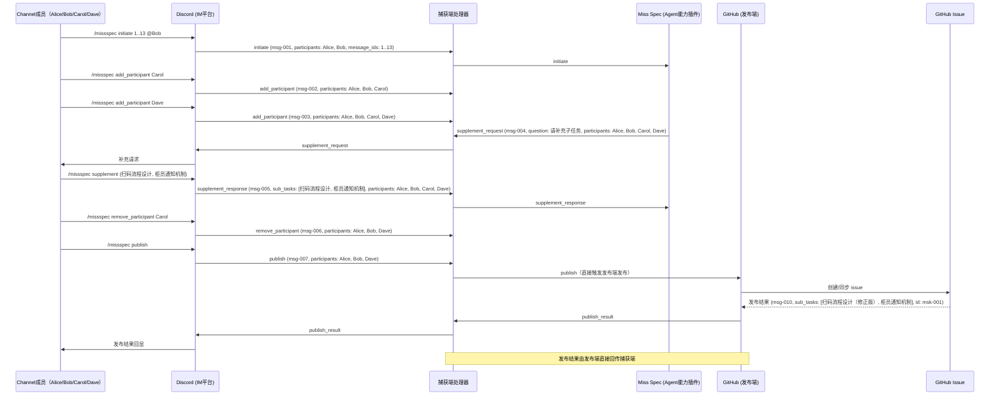

## 典型流程图示例

下图用 Mermaid sequenceDiagram 展示了 Miss Spec agent 在 Discord (IM平台) + GitHub (发布端) 场景下，多与会人动态变更的典型协作流程。payload 结构为 Miss Spec agent 的 Task 实现：

> 说明：本例为 Miss Spec agent 在 Discord (IM平台) + GitHub (发布端) 场景下的动态与会人变更协作流程，payload 结构为 Miss Spec agent 的 Task 实现。 