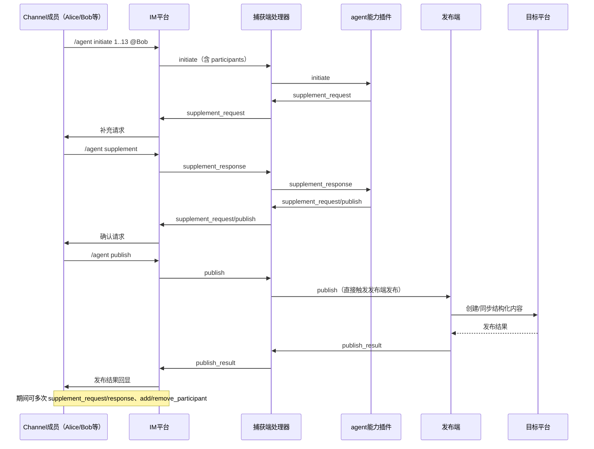

## 典型完整流程图示例

```mermaid
sequenceDiagram
    participant User as Channel成员（Alice/Bob等）
    participant IM as IM平台
    participant Capture as 捕获端处理器
    participant Agent as agent能力插件
    participant Publisher as 发布端
    participant Target as 目标平台

    User->>IM: /agent initiate 1..13 @Bob
    IM->>Capture: initiate（含 participants）
    Capture->>Agent: initiate
    Agent->>Capture: supplement_request
    Capture->>IM: supplement_request
    IM->>User: 补充请求
    User->>IM: /agent supplement
    IM->>Capture: supplement_response
    Capture->>Agent: supplement_response
    Agent->>Capture: supplement_request/publish
    Capture->>IM: supplement_request/publish
    IM->>User: 确认请求
    User->>IM: /agent publish
    IM->>Capture: publish
    Capture->>Publisher: publish（直接触发发布端发布）
    Publisher->>Target: 创建/同步结构化内容
    Target-->>Publisher: 发布结果
    Publisher->>Capture: publish_result
    Capture->>IM: publish_result
    IM->>User: 发布结果回显
    Note over IM,User: 期间可多次 supplement_request/response、add/remove_participant
```

> 说明：本流程为抽象化协作流程，涵盖 initiate、supplement_request、supplement_response、publish、publish_result、add_participant、remove_participant 等所有 CML 事件类型，适用于所有 agent 能力插件和平台扩展。 