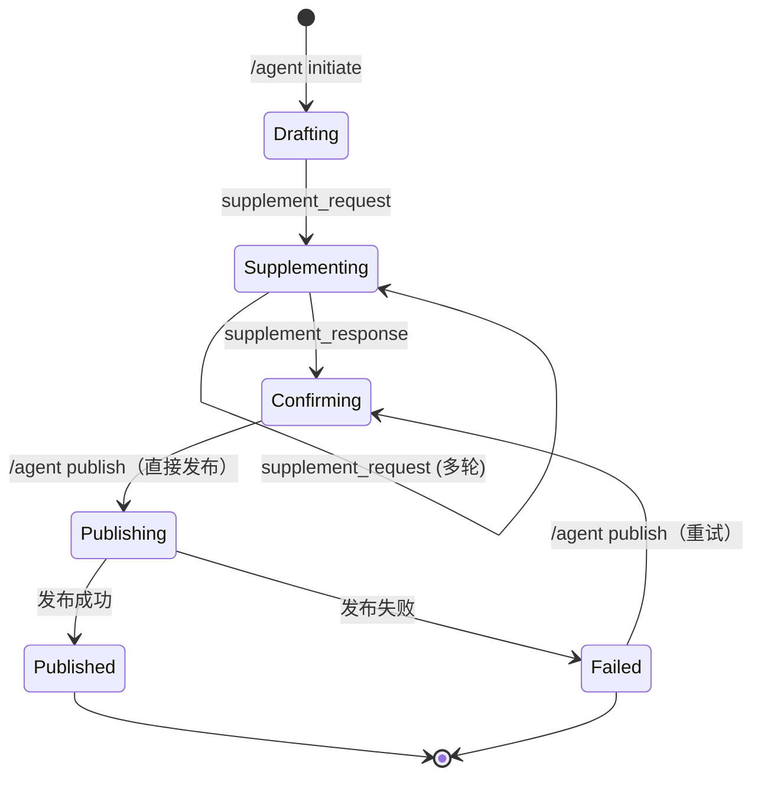

## Session 状态图

下图展示 Session 生命周期的主要状态与转换，适用于所有 Agent 能力插件：

> 说明：Session 从草稿（Drafting）发起，经过多轮补充（Supplementing）、确认（Confirming）、发布（Publishing），最终进入已发布（Published）或失败（Failed）终态。/agent publish 由 IM 平台直接与发布端交互，去除 Agent 能力插件的同步转发环节，发布失败后可重试。 