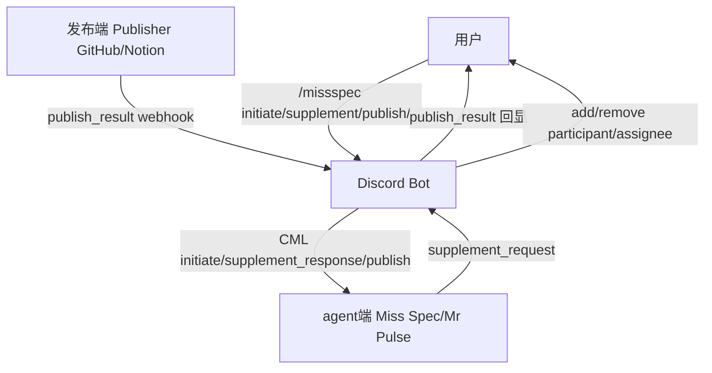

## 用例图

下图展示 Discord 发布端 主要参与者与核心用例。

```mermaid
%% Discord Upstream 主要用例图
%% Mermaid 不直接支持 usecase 语法，采用 flowchart 近似表达
flowchart TD
  User[用户]
  DiscordBot[Discord Bot]
  Summarizer[agent端 Miss Spec/Mr Pulse]
  Publisher[发布端 Publisher GitHub/Notion]

  User -- "/missspec initiate/supplement/publish/..." --> DiscordBot
  DiscordBot -- "CML initiate/supplement_response/publish" --> Summarizer
  Summarizer -- "supplement_request" --> DiscordBot
  DiscordBot -- "publish_result 回显" --> User
  Publisher -- "publish_result webhook" --> DiscordBot
  DiscordBot -- "add/remove participant/assignee" --> User
```

> 说明：用户通过 Discord 指令与 Bot 交互，Bot 负责上下文追踪与协议转换，agent端/发布端通过 HTTP/Webhook 事件流转。 