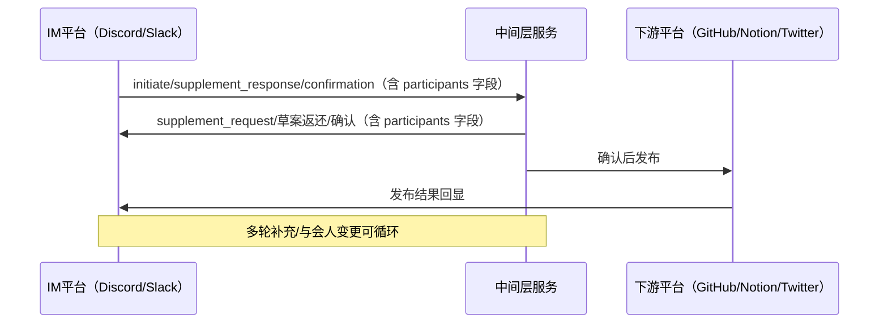
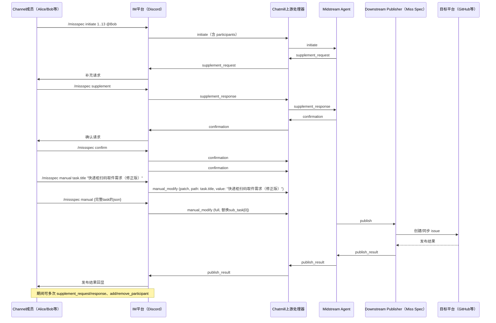
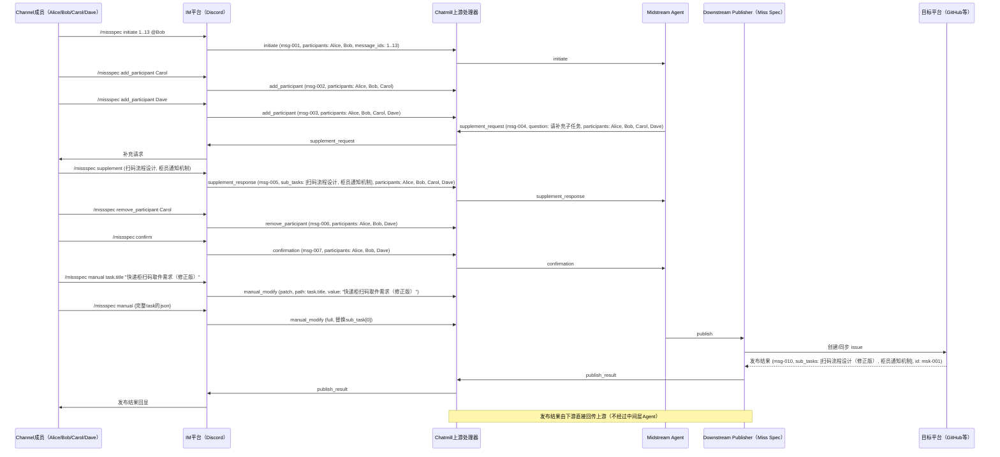

# INTERACTION GUIDE

*A comprehensive guide to all user, IM, and system interactions, commands, events, and error handling for Miss Spec/Chatmill integration.*

# 目录

- [1. Overall Sequence Diagram (from README)](#1-overall-sequence-diagram-from-readme)
- [2. CML 事件类型与示例](#2-cml-事件类型与示例)
  - [2.1 initiate](#21-initiate)
  - [2.2 supplement_request](#22-supplement_request)
  - [2.3 supplement_response](#23-supplement_response)
  - [2.4 confirmation](#24-confirmation)
  - [2.5 publish_result](#25-publish_result)
  - [2.6 add_participant](#26-add_participant)
  - [2.7 remove_participant](#27-remove_participant)
  - [2.8 add_assignee](#28-add_assignee)
  - [2.9 remove_assignee](#29-remove_assignee)
  - [2.10 manual_modify](#210-manual_modify)
- [3. 典型完整流程示例](#3-典型完整流程示例)
- [4. 例子：多人与会人动态变更的完整需求流转](#4-例子多人与会人动态变更的完整需求流转)
  - [4.1 事件流 JSON 示例](#41-事件流-json-示例)
  - [4.2 实际例子的 sequenceDiagram](#42-实际例子的-sequencediagram)
- [5. 业务异常与冲突场景总汇](#5-业务异常与冲突场景总汇)
  - [5.1 与会人管理相关](#51-与会人管理相关)
  - [5.2 责任人相关](#52-责任人相关)
  - [5.3 手动修改相关](#53-手动修改相关)
  - [5.4 事件操作权限](#54-事件操作权限)
  - [5.5 需求流转边界](#55-需求流转边界)
  - [5.6 消息/任务溯源](#56-消息任务溯源)
  - [5.7 平台/集成相关](#57-平台集成相关)
  - [5.8 用户输入与命令语法相关异常](#58-用户输入与命令语法相关异常)

---

# Chatmill Language (CML) for IM (Upstream)-Midstream Interaction

## 1. Overall Sequence Diagram (from README)



> 注：所有事件均带 participants 字段，代表当前 session 的与会人列表。add_participant/remove_participant 事件可动态调整 participants，详见下文协议说明。

## 2. CML 事件类型与示例

**本章子目录：**
- [2.1 initiate](#21-initiate)
- [2.2 supplement_request](#22-supplement_request)
- [2.3 supplement_response](#23-supplement_response)
- [2.4 confirmation](#24-confirmation)
- [2.5 publish_result](#25-publish_result)
- [2.6 add_participant](#26-add_participant)
- [2.7 remove_participant](#27-remove_participant)
- [2.8 add_assignee](#28-add_assignee)
- [2.9 remove_assignee](#29-remove_assignee)
- [2.10 manual_modify](#210-manual_modify)

### 2.1 initiate
- 说明：用于发起需求草案，可直接指定 participants 字段。
- 用法：
  - `/missspec initiate 1..13 @Bob @Carol`
- 目的：将一段讨论正式转化为结构化需求，启动需求捕捉流程。
- 游向：上游（IM/Discord） → 中间层（Agent/Summarizer）
- 字段：
  - type: "initiate"
  - session_id
  - message_id: 会话内对话唯一标识
  - source: { platform, server_id, channel_id, message_ids, participants }
  - operator_id: 操作人 Discord 用户ID
  - task: 任务对象（结构如下）
    - missspec_id: Miss Spec 本地唯一ID
    - external_id: 下游平台ID（如 github issue id，可选）
    - title: 任务标题
    - description: 任务描述
    - message_ids: 相关消息ID数组（如 [3001, ..., 3010]，支持区间，便于溯源）
    - start_time: 起始时间（ISO8601字符串，可选）
    - end_time: 结束时间（ISO8601字符串，可选）
    - storypoints: 预估工作量（可选，整数或浮点）
    - assignees: 责任人列表（如 ["alice", "bob"]，可选）
    - priority: 优先级（如 "high"/"medium"/"low"，可选）
    - sub_tasks: 子任务数组（结构同下，支持一层嵌套）
    - parent_task: 父任务唯一标识（如适用，顶层为 null）
  - history: 事件历史（字符串数组，表示历史事件的 message_id，如 ["msg-001", "msg-002"]）

| 字段名         | 类型       | 必填  | 格式/约束          | 说明               |
|-------------|----------|-----|----------------|------------------|
| type        | string   | 是   | 固定值 "initiate" | 事件类型             |
| session_id  | string   | 是   | 唯一ID           | 会话唯一标识           |
| message_id  | string   | 是   | 唯一ID           | 本事件唯一标识          |
| source      | object   | 是   | 见下表            | 来源平台及消息上下文       |
| operator_id | string   | 是   | 用户ID           | 操作人 Discord 用户ID |
| task        | object   | 是   | 见下表            | 任务对象             |
| history     | string[] | 是   | message_id 数组  | 历史事件ID溯源         |

**source 字段说明：**

| 字段名          | 类型       | 必填  | 格式/约束       | 说明       |
|--------------|----------|-----|-------------|----------|
| platform     | string   | 是   | "discord" 等 | 来源平台     |
| server_id    | string   | 是   | 唯一ID        | 服务器/群组ID |
| channel_id   | string   | 是   | 唯一ID        | 频道ID     |
| message_ids  | int[]    | 是   | 消息ID数组/区间   | 相关消息ID   |
| participants | string[] | 是   | 用户ID数组      | 当前与会人列表  |

**task 字段说明：**

| 字段名         | 类型        | 必填  | 格式/约束                 | 说明                |
|-------------|-----------|-----|-----------------------|-------------------|
| missspec_id | string    | 是   | 唯一ID                  | Miss Spec 本地唯一ID  |
| external_id | string    | 否   | 下游平台ID                | 如 github issue id |
| title       | string    | 是   | 不超过100字符              | 任务标题              |
| description | string    | 是   | 不超过1000字符             | 任务描述              |
| message_ids | int[]     | 是   | 消息ID数组/区间（区间最大25条） | 相关消息ID            |
| start_time  | string    | 否   | ISO8601               | 起始时间              |
| end_time    | string    | 否   | ISO8601               | 结束时间              |
| storypoints | int/float | 否   | 正数                    | 预估工作量             |
| assignees   | string[]  | 否   | 用户ID数组                | 责任人列表             |
| priority    | string    | 否   | "high"/"medium"/"low" | 优先级               |
| sub_tasks   | object[]  | 否   | 结构同本表                 | 子任务数组             |
| parent_task | string    | 否   | missspec_id/null      | 父任务唯一标识           |

- 示例：
```json
{
  "type": "initiate",
  "session_id": "sess-001",
  "message_id": "msg-001",
  "source": {
    "platform": "discord",
    "server_id": "654321",
    "channel_id": "123456",
    "message_ids": [3001, ..., 3010],
    "participants": ["u1", "u2", "u3"]
  },
  "operator_id": "u1",
  "task": {
    "missspec_id": "msk-001",
    "external_id": null,
    "title": "快递柜扫码取件需求",
    "description": "用户扫码后自动通知柜员，支持多家快递",
    "message_ids": [3001, ..., 3010],
    "start_time": "2024-06-01T12:00:00Z",
    "end_time": "2024-06-10T18:00:00Z",
    "storypoints": 8,
    "assignees": ["u1", "u2"],
    "priority": "high",
    "parent_task": null,
    "sub_tasks": [
      {
        "missspec_id": "msk-002",
        "external_id": null,
        "title": "扫码流程设计",
        "description": "支持顺丰、京东、菜鸟等快递扫码取件",
        "message_ids": [3001, ..., 3005],
        "start_time": "2024-06-01T12:00:00Z",
        "end_time": "2024-06-05T18:00:00Z",
        "storypoints": 3,
        "assignees": ["u1"],
        "priority": "medium",
        "parent_task": "msk-001",
        "sub_tasks": []
      },
      {
        "missspec_id": "msk-003",
        "external_id": null,
        "title": "柜员通知机制",
        "description": "扫码后自动短信+App通知柜员",
        "message_ids": [3006, ..., 3010],
        "start_time": "2024-06-06T09:00:00Z",
        "end_time": "2024-06-10T18:00:00Z",
        "storypoints": 5,
        "assignees": ["u2"],
        "priority": "high",
        "parent_task": "msk-001",
        "sub_tasks": []
      }
    ],
    "history": ["msg-001"]
  }
}
```

### 2.2 supplement_request
- 说明：用于请求补充信息，可包含结构化 sub_tasks 字段。支持 parent_task 字段用于子任务与父任务的层级关联。
- 目的：中间层发现需求信息不全，主动向上游请求补充。
- 游向：中间层（Agent/Summarizer） → 上游（IM/Discord）
- 字段：
  - type: "supplement_request"
  - session_id
  - message_id: 会话内对话唯一标识
  - source: { platform, server_id, channel_id, participants }
  - operator_id: 操作人 Discord 用户ID
  - question: 需要补充的问题
  - required_fields: 需要补充的字段
  - parent_task: 父任务的唯一标识（如适用）
  - task: 任务对象（结构同 initiate）
  - history: 事件历史（字符串数组，表示历史事件的 message_id，如 ["msg-001", "msg-002"]）

| 字段名             | 类型       | 必填  | 格式/约束                    | 说明               |
|-----------------|----------|-----|--------------------------|------------------|
| type            | string   | 是   | 固定值 "supplement_request" | 事件类型             |
| session_id      | string   | 是   | 唯一ID                     | 会话唯一标识           |
| message_id      | string   | 是   | 唯一ID                     | 本事件唯一标识          |
| source          | object   | 是   | 见下表                      | 来源平台及消息上下文       |
| operator_id     | string   | 是   | 用户ID                     | 操作人 Discord 用户ID |
| question        | string   | 是   | 不超过500字符                 | 需要补充的问题          |
| required_fields | string[] | 是   | 字段名数组                    | 需要补充的字段          |
| parent_task     | string   | 否   | missspec_id/null         | 父任务唯一标识          |
| task            | object   | 是   | 见2.1 task表               | 任务对象             |
| history         | string[] | 是   | message_id 数组            | 历史事件ID溯源         |

**source 字段说明：**

| 字段名          | 类型       | 必填  | 格式/约束       | 说明       |
|--------------|----------|-----|-------------|----------|
| platform     | string   | 是   | "discord" 等 | 来源平台     |
| server_id    | string   | 是   | 唯一ID        | 服务器/群组ID |
| channel_id   | string   | 是   | 唯一ID        | 频道ID     |
| participants | string[] | 是   | 用户ID数组      | 当前与会人列表  |

### 2.3 supplement_response
- 说明：用于提交补充内容，可包含结构化 sub_tasks 字段。支持通过区间抓取消息。
- 用法：
  - `/missspec supplement sess-001 14..20`
- 目的：上游用户对补充请求进行响应，补全需求信息。
- 游向：上游（IM/Discord） → 中间层（Agent/Summarizer）
- 字段：
  - type: "supplement_response"
  - session_id
  - message_id: 会话内对话唯一标识
  - source: { platform, server_id, channel_id, participants }
  - operator_id: 操作人 Discord 用户ID
  - supplement_messages: 本次补充消息ID数组（如 [3011, ..., 3030]，支持区间）
  - task: 任务对象（结构同 initiate）
  - history: 事件历史（字符串数组，表示历史事件的 message_id，如 ["msg-001", "msg-002"]）

| 字段名                 | 类型       | 必填  | 格式/约束                     | 说明               |
|---------------------|----------|-----|---------------------------|------------------|
| type                | string   | 是   | 固定值 "supplement_response" | 事件类型             |
| session_id          | string   | 是   | 唯一ID                      | 会话唯一标识           |
| message_id          | string   | 是   | 唯一ID                      | 本事件唯一标识          |
| source              | object   | 是   | 见下表                       | 来源平台及消息上下文       |
| operator_id         | string   | 是   | 用户ID                      | 操作人 Discord 用户ID |
| supplement_messages | int[]    | 是   | 消息ID数组/区间（区间最大25条）   | 本次补充消息ID         |
| task                | object   | 是   | 见2.1 task表                | 任务对象             |
| history             | string[] | 是   | message_id 数组             | 历史事件ID溯源         |

**source 字段说明：**

| 字段名          | 类型       | 必填  | 格式/约束       | 说明       |
|--------------|----------|-----|-------------|----------|
| platform     | string   | 是   | "discord" 等 | 来源平台     |
| server_id    | string   | 是   | 唯一ID        | 服务器/群组ID |
| channel_id   | string   | 是   | 唯一ID        | 频道ID     |
| participants | string[] | 是   | 用户ID数组      | 当前与会人列表  |

### 2.4 confirmation
- 说明：用于最终确认任务。
- 用法：
  - `/missspec confirm sess-001`
- 目的：与会人对任务内容达成一致，确认任务可进入下游发布。
- 游向：上游（IM/Discord） → 中间层（Agent/Summarizer）
- 字段：
  - type: "confirmation"
  - session_id
  - message_id: 会话内对话唯一标识
  - source: { platform, server_id, channel_id, participants }
  - operator_id: 操作人 Discord 用户ID
  - task: 任务对象（结构同 initiate）
  - history: 事件历史（字符串数组，表示历史事件的 message_id，如 ["msg-001", "msg-002"]）

| 字段名         | 类型       | 必填  | 格式/约束              | 说明               |
|-------------|----------|-----|--------------------|------------------|
| type        | string   | 是   | 固定值 "confirmation" | 事件类型             |
| session_id  | string   | 是   | 唯一ID               | 会话唯一标识           |
| message_id  | string   | 是   | 唯一ID               | 本事件唯一标识          |
| source      | object   | 是   | 见下表                | 来源平台及消息上下文       |
| operator_id | string   | 是   | 用户ID               | 操作人 Discord 用户ID |
| task        | object   | 是   | 见2.1 task表         | 任务对象             |
| history     | string[] | 是   | message_id 数组      | 历史事件ID溯源         |

**source 字段说明：**

| 字段名          | 类型       | 必填  | 格式/约束       | 说明       |
|--------------|----------|-----|-------------|----------|
| platform     | string   | 是   | "discord" 等 | 来源平台     |
| server_id    | string   | 是   | 唯一ID        | 服务器/群组ID |
| channel_id   | string   | 是   | 唯一ID        | 频道ID     |
| participants | string[] | 是   | 用户ID数组      | 当前与会人列表  |

### 2.5 publish_result
- 说明：用于下游平台发布结果回传，result.sub_tasks 字段带下游 id 及 message_ids，便于溯源。支持 parent_task 字段用于子任务与父任务的层级关联。
- 目的：下游平台（如 GitHub）将发布结果同步回上游，便于溯源和回显。
- 游向：下游（GitHub/Notion等） → 上游（IM/Discord）
- 字段：
  - type: "publish_result"
  - session_id
  - message_id: 会话内对话唯一标识
  - source: { platform, server_id, channel_id, participants }
  - task: 任务对象（结构同 initiate，含 missspec_id）
  - result: 发布结果对象（仅含发布状态、平台、url、message等）
  - history: 事件历史（字符串数组，表示历史事件的 message_id，如 ["msg-001", "msg-002"]）

| 字段名        | 类型       | 必填  | 格式/约束                | 说明         |
|------------|----------|-----|----------------------|------------|
| type       | string   | 是   | 固定值 "publish_result" | 事件类型       |
| session_id | string   | 是   | 唯一ID                 | 会话唯一标识     |
| message_id | string   | 是   | 唯一ID                 | 本事件唯一标识    |
| source     | object   | 是   | 见下表                  | 来源平台及消息上下文 |
| task       | object   | 是   | 见2.1 task表           | 任务对象       |
| result     | object   | 是   | 见下表                  | 发布结果对象     |
| history    | string[] | 是   | message_id 数组        | 历史事件ID溯源   |

**source 字段说明：**

| 字段名          | 类型       | 必填  | 格式/约束       | 说明       |
|--------------|----------|-----|-------------|----------|
| platform     | string   | 是   | "discord" 等 | 来源平台     |
| server_id    | string   | 是   | 唯一ID        | 服务器/群组ID |
| channel_id   | string   | 是   | 唯一ID        | 频道ID     |
| participants | string[] | 是   | 用户ID数组      | 当前与会人列表  |

**result 字段说明：**

| 字段名        | 类型     | 必填  | 格式/约束            | 说明       |
|------------|--------|-----|------------------|----------|
| status     | string | 是   | "success"/"fail" | 发布状态     |
| platform   | string | 是   | "github"等        | 下游平台     |
| target_url | string | 是   | URL              | 下游平台目标链接 |
| message    | string | 是   | 不超过500字符         | 发布结果说明   |

### 2.6 add_participant
- 说明：用于将用户加入当前 session 的与会人列表。
- 用法：
  - `/missspec add_participant @Carol @Dave`
- 目的：动态增加任务协作的参与人。
- 游向：上游（IM/Discord）本地存储
- 字段：
  - type: "add_participant"
  - session_id
  - message_id: 会话内对话唯一标识
  - source: { platform, server_id, channel_id, participants }
  - operator_id: 操作人 Discord 用户ID
  - participants: 变更后完整与会人列表
  - target_participants: 本次要加入的目标用户列表（必选，支持单个或多个）
  - history: 事件历史（字符串数组，表示历史事件的 message_id，如 ["msg-001", "msg-002"]）

| 字段名                 | 类型       | 必填  | 格式/约束                 | 说明               |
|---------------------|----------|-----|-----------------------|------------------|
| type                | string   | 是   | 固定值 "add_participant" | 事件类型             |
| session_id          | string   | 是   | 唯一ID                  | 会话唯一标识           |
| message_id          | string   | 是   | 唯一ID                  | 本事件唯一标识          |
| source              | object   | 是   | 见下表                   | 来源平台及消息上下文       |
| operator_id         | string   | 是   | 用户ID                  | 操作人 Discord 用户ID |
| participants        | string[] | 是   | 用户ID数组                | 变更后完整与会人列表       |
| target_participants | string[] | 是   | 用户ID数组                | 本次要加入的目标用户列表     |
| history             | string[] | 是   | message_id 数组         | 历史事件ID溯源         |

**source 字段说明：**

| 字段名          | 类型       | 必填  | 格式/约束       | 说明       |
|--------------|----------|-----|-------------|----------|
| platform     | string   | 是   | "discord" 等 | 来源平台     |
| server_id    | string   | 是   | 唯一ID        | 服务器/群组ID |
| channel_id   | string   | 是   | 唯一ID        | 频道ID     |
| participants | string[] | 是   | 用户ID数组      | 当前与会人列表  |

### 2.7 remove_participant
- 说明：用于将用户移出当前 session 的与会人列表。
- 用法：
  - `/missspec remove_participant @Carol`
- 目的：动态移除任务协作的参与人。
- 游向：上游（IM/Discord）本地存储
- 字段：
  - type: "remove_participant"
  - session_id
  - message_id: 会话内对话唯一标识
  - source: { platform, server_id, channel_id, participants }
  - operator_id: 操作人 Discord 用户ID
  - participants: 变更后完整与会人列表
  - target_participants: 本次要移除的目标用户列表（必选，支持单个或多个）
  - history: 事件历史（字符串数组，表示历史事件的 message_id，如 ["msg-001", "msg-002"]）

| 字段名                 | 类型       | 必填  | 格式/约束                    | 说明               |
|---------------------|----------|-----|--------------------------|------------------|
| type                | string   | 是   | 固定值 "remove_participant" | 事件类型             |
| session_id          | string   | 是   | 唯一ID                     | 会话唯一标识           |
| message_id          | string   | 是   | 唯一ID                     | 本事件唯一标识          |
| source              | object   | 是   | 见下表                      | 来源平台及消息上下文       |
| operator_id         | string   | 是   | 用户ID                     | 操作人 Discord 用户ID |
| participants        | string[] | 是   | 用户ID数组                   | 变更后完整与会人列表       |
| target_participants | string[] | 是   | 用户ID数组                   | 本次要移除的目标用户列表     |
| history             | string[] | 是   | message_id 数组            | 历史事件ID溯源         |

**source 字段说明：**

| 字段名          | 类型       | 必填  | 格式/约束       | 说明       |
|--------------|----------|-----|-------------|----------|
| platform     | string   | 是   | "discord" 等 | 来源平台     |
| server_id    | string   | 是   | 唯一ID        | 服务器/群组ID |
| channel_id   | string   | 是   | 唯一ID        | 频道ID     |
| participants | string[] | 是   | 用户ID数组      | 当前与会人列表  |

### 2.8 add_assignee
- 说明：用于将用户加入当前 session 的 assignees（责任人）列表。
- 用法：
  - `/missspec add_assignee @Bob @Carol`
- 目的：动态增加任务或子任务的责任人。
- 游向：上游（IM/Discord）本地存储
- 字段：
  - type: "add_assignee"
  - session_id
  - message_id: 会话内对话唯一标识
  - source: { platform, server_id, channel_id, participants }
  - operator_id: 操作人 Discord 用户ID
  - assignees: 变更后完整责任人列表
  - target_assignees: 本次要加入的责任人列表（必选，支持单个或多个）
  - history: 事件历史（字符串数组，表示历史事件的 message_id，如 ["msg-001", "msg-002"]）

| 字段名              | 类型       | 必填  | 格式/约束              | 说明               |
|------------------|----------|-----|--------------------|------------------|
| type             | string   | 是   | 固定值 "add_assignee" | 事件类型             |
| session_id       | string   | 是   | 唯一ID               | 会话唯一标识           |
| message_id       | string   | 是   | 唯一ID               | 本事件唯一标识          |
| source           | object   | 是   | 见下表                | 来源平台及消息上下文       |
| operator_id      | string   | 是   | 用户ID               | 操作人 Discord 用户ID |
| assignees        | string[] | 是   | 用户ID数组             | 变更后完整责任人列表       |
| target_assignees | string[] | 是   | 用户ID数组             | 本次要加入的责任人列表      |
| history          | string[] | 是   | message_id 数组      | 历史事件ID溯源         |

**source 字段说明：**

| 字段名          | 类型       | 必填  | 格式/约束       | 说明       |
|--------------|----------|-----|-------------|----------|
| platform     | string   | 是   | "discord" 等 | 来源平台     |
| server_id    | string   | 是   | 唯一ID        | 服务器/群组ID |
| channel_id   | string   | 是   | 唯一ID        | 频道ID     |
| participants | string[] | 是   | 用户ID数组      | 当前与会人列表  |

### 2.9 remove_assignee
- 说明：用于将用户移出当前 session 的 assignees（责任人）列表。
- 用法：
  - `/missspec remove_assignee @Carol`
- 目的：动态移除任务或子任务的责任人。
- 游向：上游（IM/Discord）本地存储
- 字段：
  - type: "remove_assignee"
  - session_id
  - message_id: 会话内对话唯一标识
  - source: { platform, server_id, channel_id, participants }
  - operator_id: 操作人 Discord 用户ID
  - assignees: 变更后完整责任人列表
  - target_assignees: 本次要移除的责任人列表（必选，支持单个或多个）
  - history: 事件历史（字符串数组，表示历史事件的 message_id，如 ["msg-001", "msg-002"]）

| 字段名              | 类型       | 必填  | 格式/约束                 | 说明               |
|------------------|----------|-----|-----------------------|------------------|
| type             | string   | 是   | 固定值 "remove_assignee" | 事件类型             |
| session_id       | string   | 是   | 唯一ID                  | 会话唯一标识           |
| message_id       | string   | 是   | 唯一ID                  | 本事件唯一标识          |
| source           | object   | 是   | 见下表                   | 来源平台及消息上下文       |
| operator_id      | string   | 是   | 用户ID                  | 操作人 Discord 用户ID |
| assignees        | string[] | 是   | 用户ID数组                | 变更后完整责任人列表       |
| target_assignees | string[] | 是   | 用户ID数组                | 本次要移除的责任人列表      |
| history          | string[] | 是   | message_id 数组         | 历史事件ID溯源         |

**source 字段说明：**

| 字段名          | 类型       | 必填  | 格式/约束       | 说明       |
|--------------|----------|-----|-------------|----------|
| platform     | string   | 是   | "discord" 等 | 来源平台     |
| server_id    | string   | 是   | 唯一ID        | 服务器/群组ID |
| channel_id   | string   | 是   | 唯一ID        | 频道ID     |
| participants | string[] | 是   | 用户ID数组      | 当前与会人列表  |

### 2.10 manual_modify
- 说明：用于手动修改任务树结构或内容，支持全量替换和路径精确修改两种模式。
- 用法：
  - `/missspec manual {完整task的json}`
  - `/missspec manual task.title 新的标题`
  - `/missspec manual task.sub_tasks[0].title 新的子任务标题`
- 目的：允许用户通过命令手动修正任务树的任意字段或整体内容。
- 游向：上游（IM/Discord） → 本地存储/中间层（如需同步）
- 字段：
  - type: "manual_modify"
  - session_id
  - message_id: 会话内对话唯一标识
  - source: { platform, server_id, channel_id, participants }
  - operator_id: 操作人 Discord 用户ID
  - mode: "full"（全量替换）或 "patch"（路径精确修改）
  - full_task: 全量替换时的新 task JSON（mode=full 时必填）
  - path: 精确修改的 JSON 路径（如 "task.title"、"task.sub_tasks[0].title"，mode=patch 时必填）
  - value: 要修改成的新值（mode=patch 时必填）
  - history: 事件历史（字符串数组，表示历史事件的 message_id，如 ["msg-001", "msg-002"]）

| 字段名         | 类型       | 必填  | 格式/约束                 | 说明               |
|-------------|----------|-----|-----------------------|------------------|
| type        | string   | 是   | 固定值 "manual_modify"   | 事件类型             |
| session_id  | string   | 是   | 唯一ID                  | 会话唯一标识           |
| message_id  | string   | 是   | 唯一ID                  | 本事件唯一标识          |
| source      | object   | 是   | 见下表                   | 来源平台及消息上下文       |
| operator_id | string   | 是   | 用户ID                  | 操作人 Discord 用户ID |
| mode        | string   | 是   | "full"/"patch"        | 修改模式             |
| full_task   | object   | 否   | 见2.1 task表（mode=full） | 全量替换的新task       |
| path        | string   | 否   | JSON路径（mode=patch）    | 精确修改路径           |
| value       | any      | 否   | 任意类型（mode=patch）      | 新值               |
| history     | string[] | 是   | message_id 数组         | 历史事件ID溯源         |

**source 字段说明：**

| 字段名          | 类型       | 必填  | 格式/约束       | 说明       |
|--------------|----------|-----|-------------|----------|
| platform     | string   | 是   | "discord" 等 | 来源平台     |
| server_id    | string   | 是   | 唯一ID        | 服务器/群组ID |
| channel_id   | string   | 是   | 唯一ID        | 频道ID     |
| participants | string[] | 是   | 用户ID数组      | 当前与会人列表  |

## 3. 典型完整流程示例

下图展示了 Miss Spec/Chatmill 典型需求流转的全链路消息流，涵盖所有 CML 事件类型及主要角色：



> 说明：该流程涵盖了 initiate、supplement_request、supplement_response、confirmation、publish_result、add_participant、remove_participant 等所有 CML 事件类型，角色分层清晰，便于未来多平台扩展和溯源。 

## 4. 例子：多人与会人动态变更的完整需求流转

**本章子目录：**
- [4.1 事件流 JSON 示例](#41-事件流-json-示例)
- [4.2 实际例子的 sequenceDiagram](#42-实际例子的-sequencediagram)

本例模拟 Alice 和 Bob 在 Discord 频道讨论快递柜扫码取件需求，后续动态添加 Carol、Dave，最终又移除 Carol，完整演示 CML 事件流、与会人变更和 sub_tasks 溯源。

### 1. initiate（Alice 发起，圈 Bob）
> 场景说明：Alice 和 Bob 在频道已经讨论了一段时间快递柜扫码取件的细节，Alice 觉得可以正式立项，于是决定把这段讨论作为需求发起。
> 
> Alice 输入命令：
> ```
> /missspec initiate 1..13 @Bob
> ```

```json
{
  "type": "initiate",
  "session_id": "sess-001",
  "message_id": "msg-001",
  "source": {
    "platform": "discord",
    "server_id": "guild-100",
    "channel_id": "chan-200",
    "message_ids": [33412, 33413, 33414, ..., 33567],
    "participants": ["alice", "bob"]
  },
  "operator_id": "alice",
  "task": {
    "missspec_id": "msk-001",
    "external_id": null,
    "title": "快递柜扫码取件需求",
    "description": "用户扫码后自动通知柜员，支持多家快递",
    "message_ids": [33412, 33413, 33414, ..., 33567],
    "start_time": "2024-06-01T12:00:00Z",
    "end_time": "2024-06-10T18:00:00Z",
    "storypoints": 8,
    "assignees": ["alice", "bob"],
    "priority": "high",
    "parent_task": null,
    "sub_tasks": [
      {
        "missspec_id": "msk-002",
        "external_id": null,
        "title": "扫码流程设计",
        "description": "支持顺丰、京东、菜鸟等快递扫码取件",
        "message_ids": [33412, 33413, 33414, ..., 33434],
        "start_time": "2024-06-01T12:00:00Z",
        "end_time": "2024-06-05T18:00:00Z",
        "storypoints": 3,
        "assignees": ["alice"],
        "priority": "medium",
        "parent_task": "msk-001"
      },
      {
        "missspec_id": "msk-003",
        "external_id": null,
        "title": "柜员通知机制",
        "description": "扫码后自动短信+App通知柜员",
        "message_ids": [33435, ..., 33567],
        "start_time": "2024-06-06T09:00:00Z",
        "end_time": "2024-06-10T18:00:00Z",
        "storypoints": 5,
        "assignees": ["bob"],
        "priority": "high",
        "parent_task": "msk-001"
      }
    ],
    "history": ["msg-001"]
  }
}
```

### 2. add_participant（加 Carol）
> 场景说明：Alice 觉得 Carol 也应该参与，于是用命令把 Carol 加入与会人。
> 
> Alice 输入命令：
> ```
> /missspec add_participant @Carol
> ```

```json
{
  "type": "add_participant",
  "session_id": "sess-001",
  "message_id": "msg-002",
  "source": {
    "platform": "discord",
    "server_id": "guild-100",
    "channel_id": "chan-200",
    "participants": ["alice", "bob", "carol"]
  },
  "operator_id": "alice",
  "participants": ["alice", "bob", "carol"],
  "target_participants": ["carol"],
  "history": ["msg-001", "msg-002"]
}
```

### 3. add_participant（加 Dave）
> 场景说明：Bob 认为 Dave 也有相关经验，主动用命令把 Dave 加入。
> 
> Bob 输入命令：
> ```
> /missspec add_participant @Dave
> ```

```json
{
  "type": "add_participant",
  "session_id": "sess-001",
  "message_id": "msg-003",
  "source": {
    "platform": "discord",
    "server_id": "guild-100",
    "channel_id": "chan-200",
    "participants": ["alice", "bob", "carol", "dave"]
  },
  "operator_id": "bob",
  "participants": ["alice", "bob", "carol", "dave"],
  "target_participants": ["dave"],
  "history": ["msg-001", "msg-002", "msg-003"]
}
```

### 4. supplement_request（Agent 请求补充子任务）
> 场景说明：中间层 Agent 发现需求描述还不够细致，自动发起补充请求，建议大家补充扫码流程和柜员通知机制。

```json
{
  "type": "supplement_request",
  "session_id": "sess-001",
  "message_id": "msg-004",
  "source": {
    "platform": "discord",
    "server_id": "guild-100",
    "channel_id": "chan-200",
    "participants": ["alice", "bob", "carol", "dave"]
  },
  "operator_id": "Miss Spec",
  "question": "请补充具体的扫码流程和柜员通知机制，建议拆分为子任务",
  "required_fields": ["sub_tasks"],
  "parent_task": null,
  "task": {
    "missspec_id": "msk-001",
    "external_id": null,
    "title": "快递柜扫码取件需求",
    "description": "用户扫码后自动通知柜员，支持多家快递",
    "message_ids": [33412, ..., 33567],
    "start_time": "2024-06-01T12:00:00Z",
    "end_time": "2024-06-10T18:00:00Z",
    "storypoints": 8,
    "assignees": [],
    "priority": null,
    "sub_tasks": [],
    "parent_task": null
  },
  "history": ["msg-001", "msg-002", "msg-003", "msg-004"]
}
```

### 5. supplement_response（Alice 用区间补充）
> 场景说明：大家讨论完毕，Alice 用区间命令补充。
> 
> Alice 输入命令：
> ```
> /missspec supplement sess-001 14..20
> ```

```json
{
  "type": "supplement_response",
  "session_id": "sess-001",
  "message_id": "msg-005",
  "source": {
    "platform": "discord",
    "server_id": "guild-100",
    "channel_id": "chan-200",
    "participants": ["alice", "bob", "carol", "dave"]
  },
  "operator_id": "alice",
  "answer": {},
  "supplement_messages": [33568, ..., 33613],
  "task": {
    "missspec_id": "msk-001",
    "external_id": null,
    "title": "快递柜扫码取件需求",
    "description": "用户扫码后自动通知柜员，支持多家快递",
    "message_ids": [33568, ..., 33613],
    "start_time": "2024-06-01T12:00:00Z",
    "end_time": "2024-06-10T18:00:00Z",
    "storypoints": 8,
    "assignees": ["alice"],
    "priority": "high",
    "sub_tasks": [
      {
        "missspec_id": "msk-002",
        "external_id": null,
        "title": "扫码流程设计",
        "description": "支持顺丰、京东、菜鸟等快递扫码取件",
        "message_ids": [33568, ..., 33590],
        "start_time": "2024-06-01T12:00:00Z",
        "end_time": "2024-06-05T18:00:00Z",
        "storypoints": 3,
        "assignees": ["alice"],
        "priority": "medium",
        "parent_task": "msk-001"
      },
      {
        "missspec_id": "msk-003",
        "external_id": null,
        "title": "柜员通知机制",
        "description": "扫码后自动短信+App通知柜员",
        "message_ids": [33591, ..., 33613],
        "start_time": "2024-06-06T09:00:00Z",
        "end_time": "2024-06-10T18:00:00Z",
        "storypoints": 5,
        "assignees": ["alice"],
        "priority": "high",
        "parent_task": "msk-001"
      }
    ],
    "parent_task": null,
    "history": ["msg-001", "msg-002", "msg-003", "msg-004", "msg-005"]
  }
}
```

### 6. remove_participant（移除 Carol）
> 场景说明：Bob 发现 Carol 其实不需要参与后续讨论，于是用命令将 Carol 移除。
> 
> Bob 输入命令：
> ```
> /missspec remove_participant @Carol
> ```

```json
{
  "type": "remove_participant",
  "session_id": "sess-001",
  "message_id": "msg-006",
  "source": {
    "platform": "discord",
    "server_id": "guild-100",
    "channel_id": "chan-200",
    "participants": ["alice", "bob", "dave"]
  },
  "operator_id": "bob",
  "participants": ["alice", "bob", "dave"],
  "target_participants": ["carol"],
  "history": ["msg-001", "msg-002", "msg-003", "msg-004", "msg-005", "msg-006"]
}
```

### 7. confirmation（Dave 确认）
> 场景说明：需求补充完毕，Dave 作为与会人之一，输入命令确认需求。
> 
> Dave 输入命令：
> ```
> /missspec confirm sess-001
> ```

```json
{
  "type": "confirmation",
  "session_id": "sess-001",
  "message_id": "msg-007",
  "source": {
    "platform": "discord",
    "server_id": "guild-100",
    "channel_id": "chan-200",
    "participants": ["alice", "bob", "dave"]
  },
  "operator_id": "dave",
  "confirmed": true,
  "history": ["msg-001", "msg-002", "msg-003", "msg-004", "msg-005", "msg-006", "msg-007"]
}
```

### 8. manual_modify（patch 用法，修改主任务 title）
> 场景说明：需求确认后，Alice 发现主任务标题有笔误，决定用 patch 命令精确修改。
> 
> Alice 输入命令：
> ```
> /missspec manual task.title "快递柜扫码取件需求（修正版）"
> ```

```json
{
  "type": "manual_modify",
  "subtype": "patch",
  "session_id": "sess-001",
  "message_id": "msg-008",
  "source": {
    "platform": "discord",
    "server_id": "guild-100",
    "channel_id": "chan-200",
    "participants": ["alice", "bob", "dave"]
  },
  "operator_id": "alice",
  "mode": "patch",
  "path": "task.title",
  "value": "快递柜扫码取件需求（修正版）",
  "history": ["msg-001", "msg-002", "msg-003", "msg-004", "msg-005", "msg-006", "msg-007", "msg-008"]
}
```

### 9. manual_modify（full 用法，替换 sub_task 内容）
> 场景说明：Bob 发现第一个子任务描述不准确，决定用 full 命令全量替换该 sub_task。
> 
> Bob 输入命令：
> ```
> /missspec manual {完整task的json}
> ```

```json
{
  "type": "manual_modify",
  "subtype": "full",
  "session_id": "sess-001",
  "message_id": "msg-009",
  "source": {
    "platform": "discord",
    "server_id": "guild-100",
    "channel_id": "chan-200",
    "participants": ["alice", "bob", "dave"]
  },
  "operator_id": "bob",
  "mode": "full",
  "full_task": {
    "missspec_id": "msk-001",
    "external_id": null,
    "title": "快递柜扫码取件需求（修正版）",
    "description": "用户扫码后自动通知柜员，支持多家快递",
    "message_ids": [33412, 33413, 33414, ..., 33567],
    "start_time": "2024-06-01T12:00:00Z",
    "end_time": "2024-06-10T18:00:00Z",
    "storypoints": 8,
    "assignees": ["alice", "bob"],
    "priority": "high",
    "parent_task": null,
    "sub_tasks": [
      {
        "missspec_id": "msk-002",
        "external_id": null,
        "title": "扫码流程设计（修正版）",
        "description": "仅支持顺丰、京东快递扫码取件（修正）",
        "message_ids": [33412, 33413, 33414, ..., 33434],
        "start_time": "2024-06-01T12:00:00Z",
        "end_time": "2024-06-05T18:00:00Z",
        "storypoints": 3,
        "assignees": ["alice"],
        "priority": "medium",
        "parent_task": "msk-001"
      },
      {
        "missspec_id": "msk-003",
        "external_id": null,
        "title": "柜员通知机制",
        "description": "扫码后自动短信+App通知柜员",
        "message_ids": [33435, ..., 33567],
        "start_time": "2024-06-06T09:00:00Z",
        "end_time": "2024-06-10T18:00:00Z",
        "storypoints": 5,
        "assignees": ["bob"],
        "priority": "high",
        "parent_task": "msk-001"
      }
    ]
  },
  "history": ["msg-001", "msg-002", "msg-003", "msg-004", "msg-005", "msg-006", "msg-007", "msg-008", "msg-009"]
}
```

### 10. publish_result（下游发布，带 sub_tasks id 和溯源 message_ids）
> 场景说明：需求确认后自动同步到下游平台（如 GitHub），下游返回发布结果。

```json
{
  "type": "publish_result",
  "session_id": "sess-001",
  "message_id": "msg-008",
  "source": {
    "platform": "discord",
    "server_id": "guild-100",
    "channel_id": "chan-200",
    "participants": ["alice", "bob", "dave"]
  },
  "task": {
    "missspec_id": "msk-001",
    "external_id": null,
    "title": "快递柜扫码取件需求",
    "description": "用户扫码后自动通知柜员，支持多家快递",
    "message_ids": [33412, ..., 33567],
    "start_time": "2024-06-01T12:00:00Z",
    "end_time": "2024-06-10T18:00:00Z",
    "storypoints": 8,
    "assignees": ["alice", "bob"],
    "priority": "high",
    "parent_task": null,
    "sub_tasks": [
      {
        "missspec_id": "msk-002",
        "external_id": null,
        "title": "扫码流程设计",
        "description": "支持顺丰、京东、菜鸟等快递扫码取件",
        "message_ids": [33412],
        "start_time": "2024-06-01T12:00:00Z",
        "end_time": "2024-06-05T18:00:00Z",
        "storypoints": 3,
        "assignees": ["alice"],
        "priority": "medium",
        "parent_task": "msk-001"
      },
      {
        "missspec_id": "msk-003",
        "external_id": null,
        "title": "柜员通知机制",
        "description": "扫码后自动短信+App通知柜员",
        "message_ids": [33413],
        "start_time": "2024-06-06T09:00:00Z",
        "end_time": "2024-06-10T18:00:00Z",
        "storypoints": 5,
        "assignees": ["alice"],
        "priority": "high",
        "parent_task": "msk-001"
      }
    ]
  },
  "result": {
    "status": "success",
    "platform": "github",
    "target_url": "https://github.com/org/repo/issues/456",
    "message": "需求已成功同步到 GitHub 项目板。"
  },
  "history": ["msg-001", "msg-002", "msg-003", "msg-004", "msg-005", "msg-006", "msg-007", "msg-008"]
}
```

> 说明：本例完整演示了与会人动态增删、需求补充、子任务溯源、下游发布等全链路 CML 事件流。

### 4.2 实际例子的 sequenceDiagram

下图用 Mermaid sequenceDiagram 直观展示了上述例子的事件流转、与会人动态变化和真实数据流：



> 该图与上方 JSON 例子一一对应，帮助理解真实业务流和与会人动态。 

## 5. 业务异常与冲突场景总汇

本章汇总了 Miss Spec/Chatmill 在 IM 端与上游处理器交互过程中，常见的业务异常与冲突场景，便于产品、开发和对接方理解和处理。

### 5.1 与会人管理相关
- **场景**：添加与会人时，目标用户并不在当前 channel/guild 中
  - 可能原因：用户输入了未加入频道的成员
  - 推荐提示语：`用户不在当前频道，无法添加为与会人。`
- **场景**：移除与会人时，目标用户本就不在与会人列表
  - 可能原因：用户误操作或与会人列表已变更
  - 推荐提示语：`用户不在与会人列表，无需移除。`
- **场景**：与会人全部被移除
  - 可能原因：连续移除操作导致与会人列表为空
  - 推荐提示语：`至少保留一名与会人，无法全部移除。`

### 5.2 责任人相关
- **场景**：添加责任人时，目标用户不是与会人
  - 可能原因：责任人必须先成为与会人
  - 推荐提示语：`责任人必须是与会人，请先添加为与会人。`
- **场景**：移除责任人时，目标用户本就不是责任人
  - 可能原因：误操作或责任人列表已变更
  - 推荐提示语：`用户不是责任人，无需移除。`

### 5.3 手动修改相关
- **场景**：patch 路径不存在或类型不符
  - 可能原因：用户输入了错误的 JSON 路径或类型
  - 推荐提示语：`指定路径不存在或类型不符，修改失败。`
- **场景**：full 替换时结构不合法
  - 可能原因：新 task 结构缺少必填字段或格式错误
  - 推荐提示语：`新任务结构不合法，替换失败。`
- **场景**：修改 sub_task 时 missspec_id 冲突或丢失
  - 可能原因：sub_task id 重复或遗漏
  - 推荐提示语：`子任务 ID 冲突或缺失，无法替换。`

### 5.4 事件操作权限
- **场景**：非与会人尝试补充、确认、手动修改
  - 可能原因：用户未被添加为与会人
  - 推荐提示语：`仅与会人可进行此操作。`

### 5.5 需求流转边界
- **场景**：重复确认/补充/发布
  - 可能原因：用户多次提交同一操作
  - 推荐提示语：`该操作已完成，无需重复提交。`
- **场景**：补充响应时 session 已关闭
  - 可能原因：会话已被终止或超时
  - 推荐提示语：`会话已关闭，无法补充。`

### 5.6 消息/任务溯源
- **场景**：history 中 message_id 不存在或已被删除
  - 可能原因：历史消息被清理或引用错误
  - 推荐提示语：`历史消息不存在，部分溯源失败。`

### 5.7 平台/集成相关
- **场景**：同步到下游平台失败（如 GitHub API 限流/权限不足）
  - 可能原因：下游平台接口异常、权限不足或网络问题
  - 推荐提示语：`下游平台同步失败，请稍后重试或联系管理员。`
- **场景**：下游平台（如 GitHub、Notion）API 限流、超时、服务不可用
  - 可能原因：平台接口限流、网络波动、平台维护
  - 推荐提示语：`下游平台暂时不可用，请稍后重试。`
- **场景**：下游平台权限不足（如机器人未授权、token 失效）
  - 可能原因：集成账号权限变更、token 过期或被撤销
  - 推荐提示语：`下游平台权限不足，请联系管理员重新授权。`
- **场景**：下游平台对象不存在（如 issue、project、repo 被删除）
  - 可能原因：目标对象被手动删除或迁移
  - 推荐提示语：`下游平台目标对象不存在或已被删除。`
- **场景**：下游平台字段/格式不兼容（如 title/description 超长、特殊字符）
  - 可能原因：字段长度超限、包含平台不支持的字符
  - 推荐提示语：`部分内容未能同步，字段超限或包含不支持字符。`
- **场景**：下游平台 webhook 回调失败
  - 可能原因：网络异常、回调地址配置错误
  - 推荐提示语：`下游平台回调失败，请检查 webhook 配置。`
- **场景**：多平台同步时部分平台成功、部分失败
  - 可能原因：多平台集成，部分平台异常
  - 推荐提示语：`部分平台同步失败，请检查各平台状态。`
- **场景**：平台集成版本不兼容或 API 变更
  - 可能原因：下游平台升级导致接口变更
  - 推荐提示语：`下游平台接口变更，请联系管理员适配新版本。`

### 5.8 用户输入与命令语法相关异常
- **场景**：session_id 输入错误/不存在
  - 可能原因：用户输入了不存在的 session_id
  - 推荐提示语：`未找到对应会话，请检查 session_id 是否正确。`
- **场景**：server_id/channel_id 不匹配
  - 可能原因：用户输入的 session_id 存在，但 server_id 或 channel_id 不一致
  - 推荐提示语：`会话与当前频道/服务器不匹配。`
- **场景**：命令语法错误
  - 可能原因1：命令格式不对，如 `/missspec [没有这个命令] xxx`
    - 推荐提示语：`未知命令，请检查语法或输入 /missspec help 查看用法。`
  - 可能原因2：参数分隔符错误，如 `/missspec initiate 12, 14. 15`（14后面是句号）
    - 推荐提示语：`消息区间格式错误，正确格式如 12..15 或 12,14,15。`

- **场景**：命令缺少必填参数
  - 可能原因：用户只输入了 `/missspec initiate`，未指定消息区间或与会人
  - 推荐提示语：`命令缺少必填参数，请输入 /missspec help 查看用法。`
- **场景**：参数顺序错误或多余参数
  - 可能原因：用户输入 `/missspec initiate @Bob 1..13`（顺序错），或多加了无效参数
  - 推荐提示语：`命令参数顺序或数量有误，请输入 /missspec help 查看正确用法。`
- **场景**：@用户格式错误或用户不存在
  - 可能原因：用户输入 `/missspec add_participant Bob`（未加@），或@的用户不存在
  - 推荐提示语：`请使用 @用户名 格式，并确保用户存在。`
- **场景**：消息区间格式错误
  - 可能原因：用户输入 `/missspec initiate 1-13`（用 - 而不是 ..），或 `/missspec initiate 1..`（缺失结束）
  - 推荐提示语：`消息区间格式错误，正确格式如 12..15 或 12,14,15。`
- **场景**：参数类型错误
  - 可能原因：用户输入 `/missspec supplement sess-001 abc`（消息ID应为数字）
  - 推荐提示语：`参数类型错误，请检查消息ID等参数格式。`
- **场景**：命令大小写混用或拼写错误
  - 可能原因：用户输入 `/MissSpec Initiate`
  - 推荐提示语：`命令区分大小写，请使用 /missspec initiate 等标准格式。`
- **场景**：session_id、message_id、user_id 等 ID 格式非法
  - 可能原因：用户输入了不符合规范的 ID（如带空格、特殊字符）
  - 推荐提示语：`ID 格式非法，请检查输入内容。`
- **场景**：命令过长或参数超出限制
  - 可能原因：一次性输入过多消息ID或@用户
  - 推荐提示语：`命令参数过多，请分批操作。`
- **场景**：命令中包含敏感词或非法字符
  - 可能原因：用户输入了不允许的内容
  - 推荐提示语：`命令中包含非法字符，请重新输入。`
- **场景**：命令在不支持的频道/私聊中使用
  - 可能原因：用户在私聊或未授权频道使用
  - 推荐提示语：`该命令仅支持在指定频道/群组中使用。`
- **场景**：命令冷却时间未到（防刷屏/限流）
  - 可能原因：用户短时间内多次重复操作
  - 推荐提示语：`操作过于频繁，请稍后再试。`
- **场景**：命令与当前会话状态冲突
  - 可能原因：会话已关闭、已归档、已发布，用户还在尝试补充/修改
  - 推荐提示语：`当前会话状态不支持此操作。`
- **场景**：消息区间过长（如 /missspec initiate 1..100）
  - 可能原因：一次性输入的消息区间超出最大限制（25条）
  - 推荐提示语：`一次性添加的消息区间不能超过25条，请缩小范围或分批操作。`